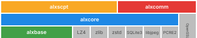

# AlxLib

A general-purpose C++ library (C++11 and later): data types, cryptography, compression, networking, databases, and a script engine.

## Modules

| Module | Responsibility | Depends on |
|------|------|------|
| **alxbase** | basic types (bytes/variant), serialization, JSON/XML/CSV, string utilities, factory pattern, crypto (AES), digest/checksum, date/time | none |
| **alxcore** | file I/O, compression (LZ4/Gzip/zstd), SQLite, images, thread pool, logger, fiber | alxbase |
| **alxscpt** | script engine (lex → parse → compile → execute) | alxbase, alxcore |
| **alxcomm** | communication: TCP/UDP transport, HTTP server/client, RPC framework | alxbase, alxcore |

<p align="center">
  
</p>

## Build

### Dependencies

- CMake ≥ 3.16
- GCC/Clang (C++11 and later — the public headers are C++11-clean; the build itself and the test suites use C++17, which Google Test requires, so C++11/14 carry no test coverage)
- the third-party libraries must be provided by yourself and placed under `3rdpty/` (manifest, build requirements and sha256 in `3rdpty/README.md`): zlib, LZ4, zstd, SQLite3, libjpeg-turbo, PCRE2
- OpenSSL (optional, for TLS)

### Compiling

```bash
cmake -B build \
    -DALXLIB_OPT_LEVEL=2 \
    -DBUILD_TESTS=ON \
    -DBUILD_EXAMPLES=ON
cmake --build build -j7
```

Output lands in `bin/` (`-DALXLIB_BIN_DIR=<dir>` names another directory, relative to the source root or absolute).

### CMake options

| Option | Default | Meaning |
|------|--------|------|
| `ALXLIB_OPT_LEVEL` | `3` | optimization level (0/1/2/3) |
| `ALXCOMM_TLS` | `ON` | enable TLS (needs OpenSSL) |
| `ALXLIB_SPLIT_DEBUG` | `OFF` | split debug info into `.debug` files |
| `ALXLIB_BIN_DIR` | `bin` | output directory (relative to the source root or absolute) |
| `ALXBASE_ENABLE` | `ON` | build alxbase |
| `ALXCORE_ENABLE` | `ON` | build alxcore |
| `ALXSCPT_ENABLE` | `ON` | build alxscpt |
| `ALXCOMM_ENABLE` | `ON` | build alxcomm |
| `ALXLIB_STATIC` | `OFF` | build the merged static library `alxlib.a` |
| `BUILD_TESTS` | `ON` | build the Google Test suites |
| `BUILD_EXAMPLES` | `ON` | build the example programs |

### Packaging

```bash
./bash/package.sh
# produces AlxLib-<version>-linux-x64-g<short sha>.tar.gz
```

## Quick start

### Bytes — COW binary buffer

```cpp
#include "abytes.h"
using namespace alx;

bytes a("hello", 5);
bytes b = a;           // COW, data is shared
b.append(" world", 6);
assert(a.size() == 5); // a is untouched
assert(b.size() == 11);
```

### Variant — type-safe union

```cpp
#include "avariant.h"
using namespace alx;

variant v(int_64(42));
v = "hello";           // the type switches dynamically
if (v.is<std::string>()) {
    auto s = v.to<std::string>();
}
```

### JSON

```cpp
#include "ajson.h"
using namespace alx;

varmap m;
m["name"] = variant("AlxLib");
m["version"] = variant(int_64(1));
auto json = json_doc::to_string(json_value::from_variant(m));
```

### Script engine

```cpp
#include "ascript.h"
using namespace alx;

script::engine_config cfg;
cfg.max_stack = 2048;
auto* eng = script::engine::create(cfg);

auto res = eng->exec(
    bytes_view(bytes("var x = 1 + 2; x * 10;")),
    "");
// res.value == variant(int_64(30))
```

## Directory layout

```
AlxLib/
├── include/          public headers
│   ├── alxbase/      basic types
│   ├── alxcore/      system extensions
│   ├── alxscpt/      script engine
│   └── alxcomm/      communication
├── source/           implementation sources
├── 3rdpty/           third-party libraries (zlib, LZ4, zstd, SQLite3, libjpeg-turbo, PCRE2, OpenSSL)
├── cmake/            CMake build scripts
├── gtest/            Google Test suites
├── example/          example programs
│   ├── Scpt/         script engine CLI
│   └── Lza/          LZ4 compression tool (Qt GUI)
├── bindings/         language bindings (Node.js, Python)
├── doc/              documentation
│   ├── architecture.svg  architecture diagram
│   ├── base/         alxbase: api.md / design.md / notice.md
│   ├── core/         alxcore: api.md / design.md / notice.md
│   ├── comm/         alxcomm: api.md / design.md / notice.md
│   └── scpt/         alxscpt: api.md / lang.md / design.md / notice.md / bench.md
└── bin/              build output
```

## Documentation

Each module's docs come as a trio — API Manual / Design / Known Limits and Pitfalls — each piece self-contained; **this page is the only entry point**.

| Module | API Manual (consumer side) | Design (design decisions, implementation, tuning) | Known limits and pitfalls (open defects + known limits) |
|------|-------------------|--------------------------------|-------------------------------|
| **alxbase** | [api.md](doc/base/api.md) | [design.md](doc/base/design.md) | [notice.md](doc/base/notice.md) |
| **alxcore** | [api.md](doc/core/api.md) | [design.md](doc/core/design.md) | [notice.md](doc/core/notice.md) |
| **alxcomm** | [api.md](doc/comm/api.md) | [design.md](doc/comm/design.md) | [notice.md](doc/comm/notice.md) |
| **alxscpt** | [api.md](doc/scpt/api.md) | [design.md](doc/scpt/design.md) | [notice.md](doc/scpt/notice.md) |

Other:

- [Language reference](doc/scpt/lang.md) — Alexis Script syntax and semantics
- [Engine benchmark](doc/scpt/bench.md) — interpreter performance baseline and A/B data

## License

MIT License. Copyright (c) 2026 AlexisVon.

Every source file in `source/`, `include/`, `gtest/`, `bindings/` and `tools/` carries `SPDX-License-Identifier: MIT` in its header, pointing at the full MIT text in this repo's root [LICENSE](LICENSE); the build files beside them and everything under `example/` are covered by that same `LICENSE` rather than by a per-file line.

Third-party components and their licenses: see [THIRD-PARTY.md](THIRD-PARTY.md).

This software is based in part on the work of the Independent JPEG Group.
