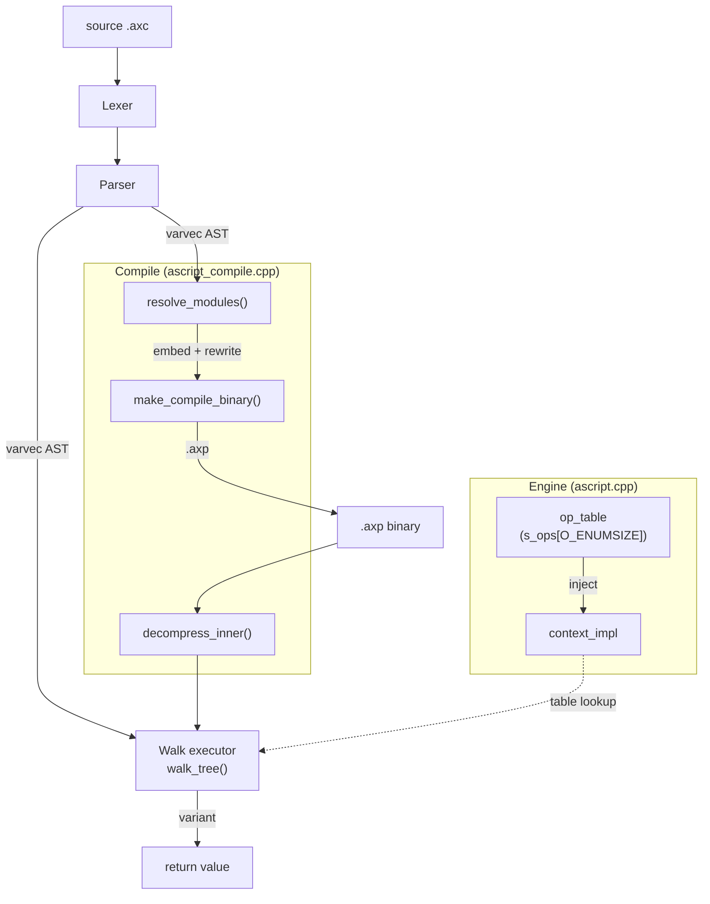

# Alexis Script — Design

## Design principles

> **Design red line: the script layer must not crash the engine.** Any script input (including deliberately hostile input) may at most raise `script_exception`; the engine process must survive. Exposing raw pointers, unchecked bounds, and uncaught exceptions all violate this. Linking a native library is not covered by this rule (it cannot be kept in check, and is not), so its crash is not the engine's responsibility.

| Principle | Description |
|------|------|
| **Permanent value semantics** | The script engine does not expose C++ raw pointers to the script layer. foreach reference semantics were evaluated and reverted (`ref_map` → SIGSEGV → unrecoverable). All variable access, argument passing and iteration are value copies. **Exception**: fwrap arguments are pointer-held for the link layer (C++) (`variant&` writable view, 2026-08-12); the argument semantics the script layer sees are unchanged (evaluated by value, bound by value); raw pointers are exposed only to the link layer, carrying an invalidation contract |
| **An exception must not crash the host** | `script_exception` is not re-thrown to the host. The `engine::exec` catch chain does trace + reset + `on_cerr` + return |
| **Defensive bounds checks** | Array out of bounds → `IndexError`, missing map key → `KeyError`, type mismatch → `TypeError`. No silent null return |
| **Link libraries are out of control** | Crashes and memory safety of native C++ code (`.so`/`.dll`) are not the engine's responsibility |

---

## 1. Architecture overview



**Design decisions:**
- **Three-layer separation**: Engine (thin wrapper + state holder), Compile (pure data pipeline), Walk (runtime execution)
- **AST node types are enumerated**: `op_enum` (`uint_8`) is defined in `ascript_enum.h`, replacing the former `std::string` tag. The `varvec[0]` the parser produces changed from `variant(string)` to `variant(uint_8)`; the walker dispatches by O(1) indexing into the bare `op_func[O_ENUMSIZE]` array via `O_ENUMSIZE`
- **var_map promote cache**: once `var_ptr()` finds a variable in an outer frame it promotes it into the current frame's var_map, so later accesses hit in O(1) and the repeated cross-frame hash disappears
- **token_type de-classing**: `enum class token_type` → `enum tk_enum`; the former `T_BUILTIN_FUNC` is gone, split into separate tokens (`T_INT`/`T_FLOAT`/`T_STRING`/`T_BOOL`/`T_VEC`/`T_MAP`/`T_LST`/`T_TYPE`/`T_ENV`; `T_TOJS`/`T_FMJS`/`T_PRINT`/`T_INPUT` were removed along with their 2026-08-04 migration out to extension functions)
- **Unified data_store storage**: all data (variables / defs / native functions / sub-entities / link modules / areas) is stored in `data_store` (`vector<variant> m_data` + `unordered_map m_map` + `vector m_free`), exposing `find`/`store`/`remove`/`contain`. Script objects are accessed through `anyptr` (`call_able` unifies def/native, `link_area` holds the area object + natives). `fly_link` holds `data_store m_store` directly (the template data), and `fly_import` holds its template in `m_root` — an `impl_import` the init walk runs on directly, so a child imported during that walk binds its `m_parent` to a live object; `impl_fly_import` deep-copies the template from `fly->m_root.m_store` and re-points every cloned child (recursively) at the new instance. An instance holds a fly ref (`m_ref.ref()`) so that sharing among multiple instances cannot release it early. `mod_mng::release_fly` manages the fly lifetime passively
- **walker class encapsulation**: the `walker` class holds `walk_state state` + `mod_mng* mgr` + the static op dispatch table `s_ops`; every op function and helper is a walker static method, and `walk_tree()`/`walk_forest()` are walker member functions. The Engine holds a `mod_mng` + a `walker` and exposes functionality through the `engine` class and the `fwrap` interface
- `fwrap::bind(name, func[, area])` — register a native function: no area → `m_store.store(name, anyptr<call_able>)`; with area → create a link_area → store the native into area->m_natives
- `fwrap::object()` — the C++ object currently bound to the area (`&m_area->m_object`)
- `fwrap::unwrap<T>()` — `anyptr_ex<T>::as(*object())`, null-guarded — type-safe unwrapping
- `fwrap::wrap<T>(ptr, area, methods)` — store the anyptr + bulk-register the area methods (creates an instance dynamically)
- **Module namespace shielding**: an `import`/`link` `as` alias is an opaque namespace; its members are reachable only through `.` (`alias.func()`, `alias.x`) and a bare read as a value is refused — `op_load`, the terminal read in `op_dot` and `resolve_ptr` check `impl_import`/`impl_link`, so `var x = alias` and `alias += 1` raise `TypeError`. Where the handle is handed on instead of read — a call argument, a return, `@("alias")` — the instance is **copied** (value semantics). The copy's parent is its holder: every binding site stamps the slot it wrote (`bind_owner` from `store_raw` / `assign_raw` / `scope_frame::raw_store` / the `resolve_ptr` store branch, whose out-parameter names the resolved slot's owner), so `..` from the copy resolves in the module that holds it; a copy that is never bound (a temporary, or one merely carried inside a container until it is read out into a binding) has no parent. The copy is independent of the original — its own store, its own sub-module instances (the copy constructor re-binds its children to the copy), its own fly reference — so a later `delete` of the original does not touch it. link additionally shields dot writes (`alias.x = v` → `TypeError`); import allows dot writes (they write into the import entity's `m_store`). An area instance/namespace (a non-callable anyptr) can be removed by the script with `delete` (the anyptr destructor destroys the host object); link/area functions (callable) and data variables cannot be deleted → `TypeError`. The script can only reach link data operations indirectly, through functions the area registered
- `scope_frame` binds `impl_import*` by RAII: the constructor records `base` (`ent->m_store.m_data.size()`), the destructor resizes `ent->m_store.m_data` back to base. Exposes `find`/`store`/`remove`/`contain`
- `scope_frame::def` — `const varvec*` function definition pointer, used for call-stack tracing on an exception (the trace lazily builds an entity → def→name reverse mapping)
- Variable data lives in `data_store` (`m_data` + `m_map` + `m_free`), which gives O(1) resize rollback and zero-cost template copying
- `scope_frame::var_map` uses `size_t` absolute indices, indexing `ent->m_store.m_data` directly
- A module top level has no main frame — `var` writes straight into `impl_import::m_store` (`m_map` → `m_data`); frames are created only for function calls
- `walker::reset()` = `state.clear()` + set `state.root`/`state.current` (no frame push)
- `walker::walk_state_trace()` — builds the call-stack string from the frames left over globally
- `walker::init()` — idempotently initialises the static `s_ops` table; called automatically from the walker constructor
- `native_func` signature: `void (*)(fwrap&)` — fwrap provides args/freturn/load/store/bind
- **fwrap arguments are pointer-held (2026-08-12)**: an argument is pointer-held (a `variant&` writable view), collected in two passes (literals/expressions go into a `std::list` at the call site; variables are deferred until every argument has been evaluated, then their slot pointers are resolved in one go, zero-copy). **Contract**: reads and writes are safe until the first `fw.call()` back into script (after that they are invalidated or the contents may change, and must not be used again); a write to a variable argument is visible to the caller; an out-of-bounds access raises `IndexError`. **Call semantics**: one rule for the whole language, "read at the end" — arguments are evaluated left to right (side-effect order unchanged) and the value of a variable argument is read only after every argument has been evaluated (identical for natives and defs)
- `script_load / script_unload / script_free` — link `.so` entry points, `void (*)(fwrap&)`. load is called once per fly; unload is called when the fly's last reference is released (optional); free is called when each link instance is destroyed (optional)
- Path resolution (runtime import/link): an absolute path is looked up directly → the current instance's env list in order (**before any `env()` call the list holds the module's own directory as an absolute path**, in force while env() has not been called; an env() call replaces it; an explicit `env([])` empties it) → the list the host set with `engine::set_search_paths` (engine search paths) → a fallback relative to the CWD (when CLI/cache mode has no script path)

---

## 2. File structure

```
include/alxscpt/ascript.h          — public API (engine + fwrap + script_exception + error_type)
source/alxscpt/
  ascript.cpp                      — thin engine wrapper (holds res_mng + walker)
  script/
    ascript_enum.h                 — op_enum + tk_enum definitions
    ascript_base.h                 — base types (data_store, call_able, link_area, fly/impl, scope_frame, walk_state)
    ascript_utils.h                — type utilities (type_pair, eq_cmp, cov_*, type_name_script, switch dispatch)
    ascript_lex.{h,cpp}            — Lexer
    ascript_dot.{h,cpp}            — Dot chain resolution (resolve_dot / step / get)
    ascript_parse.{h,cpp}          — Parser
    ascript_compile.{h,cpp}        — Compile pipeline
    ascript_walk.{h,cpp}           — walker class (op dispatch + built-in functions + scope_frame)
    ascript_fwrap.{h,cpp}          — fwrap virtual class implementation
    ascript_modmng.{h,cpp}         — instance layer (per-engine fly pool + simplified gate)
    ascript_resmng.{h,cpp}         — resource layer (AST cache + link handle pool, the only multithreaded surface)
    ascript_trace.{h,cpp}          — call-stack trace compression (repeated-segment folding)
gtest/alxscpt/src/
  gt_ascript_lex.cpp               — Lexer tests
  gt_ascript_parse.cpp             — Parser tests
  gt_ascript_walk.cpp              — Walk tests
  gt_ascript_compile.cpp           — Compile pipeline tests
  gt_ascript_context.cpp           — fwrap/walker unit tests
  gt_ascript_debug.cpp             — debug positions: O_DEBUG markers, row/col of uncaught errors, debug hook events
  gt_ascript_pipe.cpp              — host IO pipe unit tests (set_pipe routing via fwrap)
  gt_ascript_trace.cpp             — call-stack trace compression tests (compress_trace / format_trace)
  gt_ascript_utils.cpp             — variant conversion / comparison / trace unit tests
  gt_ascript.cpp                   — Engine integration tests
doc/scpt/bench.md                  — performance benchmark
example/Scpt/                      — CLI + base.so
```

---

## 3. Syntax & AST

> **AST node types are stored as `op_enum` (`uint_8`).** `varvec[0]` is a `variant(uint_8)` (e.g. `O_IMPORT`). All 89 op_enum values are defined in `source/alxscpt/script/ascript_enum.h` (the compound assignments `O_ASS_*` are one opcode per operator, emitted directly by the compound-assignment parse path).

**Literals**: `"string"` / `'string'` (escaped; the complementary `"` and `'` reduce escaping), `` `raw string` `` (no escapes, may span lines). The lexer emits `T_STRING_LITERAL` / `T_BACKTICK_STRING`; the parser produces a `variant(string)` leaf node either way.

### 3.1 Import / Link

```
import "module.axc" as name;     →  [O_IMPORT, "path", "alias"]
link "native" as name;        →  [O_LINK,   "path", "alias"]
env(paths);                      →  [O_ENV,    paths]
```

`as NAME` is mandatory; missing = syntax error. `O_IMPORT`/`O_LINK` are allowed at top level only.

**Suffix guessing**: when an import/link path gives no suffix, the engine first looks it up without a suffix and only then guesses:
- `import "foo"` → first `foo`, then `foo.axp`, finally `foo.axc`
- `link "foo"` → first `foo`, then `foo.so` (Linux) / `foo.dll` (Windows) / `foo.dylib` (macOS)

**Cross-platform advice**: leave the platform-specific suffix (such as `.so`) out of a link path and let the engine guess it, which eases cross-platform deployment.

### 3.1b here — compile-time position constant

```
here() → [O_HERE, {row, col, ofst, file}]   // varmap literal, built during parse
```

- `T_HERE` token (reserved word, function form only; a bare use = syntax error)
- parse_primary intercepts it: the token's own row/col/ofst are taken and packed into a varmap stored in the node; every value is a script int
- `file` = the parsing context path (`file_info::path()`, i.e. `conver_std_path`): the file entry gives the source file's absolute path; with a directory context only (`exec(src, dir)`) it is the directory; with no context (REPL / byte execution) it is the empty string
- An engine file entry (`exec(file)`/`compile(path)`) hands the real source file path to the parser through `m_src_file` (an RAII guard), as distinct from the home_dir directory; an import module passes the module file path directly in `load_module_ast`
- The walker's `op_here` returns the node's map directly (no computation)
- Use: script-level assert / logging / custom exceptions carrying the call point's position (a compile-side debug primitive)

### 3.2 Chain access AST

**Unified dot chain model** — "dot chain" and "nav chain" are no longer distinguished. "`..`/`::`/`.`" are merely locating markers inside the chain; `.()` separates entity navigation from data access.

```
No prefix:   a.b.c[0]     → all access segments — climb frames for var a → value chain .b.c[0]
Prefixed:    ..a.b         → all locate segments — pure entity navigation, the result is an entity
          ..a.b.(c.d)   → locate segment ..a.b, .(...) bridges, access segment c.d
          ::a.b.(c[0])  → locate segment ::a.b, bridge, index inlined as int_64
```

**A prefixed dot chain must carry a bridge** — a locate segment standing alone returns only an entity (void at the script layer); `.(...)` is mandatory to reach variables/functions/link/area.

**Name constraint (2026-08-06 decision, with computed-value cascades evaluated)**: an element in the middle of a dot chain must be **named** — a variable slot or a navigation token. A computed value (a temporary such as `f()`) does not enter `resolve_dot`: under value semantics a temporary has no persistent storage, and supporting it would need eval plus temporary-slot management (write path, aliasing, lifetime) — high complexity, low payoff, so it is refused by design. A computed value takes keys with `[]` (O_INDEX goes down the eval path, which supports it natively — step::field container navigation `f()["x"]["y"]` already covers the read path completely).

A dedicated evaluation of computed-value dot cascades (`f().x.y`) (2026-08-06): O_INDEX already covers it equivalently → pure syntactic sugar; the write/delete paths are semantically empty for a temporary (a temporary dies as soon as it is written, and the script has no reference semantics) → it should be a runtime TypeError. The one non-equivalent case = a named navigation whose chain head returns an entity (`get_mod().func()` — O_INDEX can only index a container, it cannot navigate an anyptr\<impl_import\>) — a function dynamically returning a module reference is rare, and opening a bridge for it is not worth it. The navigation-segment family as it stands: the locating kinds (a name / `..` parent / `::` root / `.` current module) plus the `.()` bridge as the only special case — the parse layer forces the bridge to be chain-terminal (the message in ascript_parse.cpp is `bridge .(...) requires a nav prefix (. .. ::)`; the postfix loop breaks after the bridge, so nothing can follow it), and a mid-chain call `a.b().x` is refused just the same.

At runtime `resolve_dot()` walks the chain: an OPTYPE marker drives the entity jump (O_PARENT/O_ROOT/O_CURRENT), while a string/int switches among the T_Variant/T_Slot/T_Callable states. After N-1 steps the terminal key is left in `dot_resolved::key` and the caller dispatches it itself. link/area data is completely shielded from the script (read/write/delete → TypeError); the shield sits on the resolved terminal — `dot_resolved::link_owner` marks a chain that entered a link's data — so an element or nested key is refused exactly like the link's own slot.

The parser flattens the whole chain into `[O_DOT, elem...]` — no `O_INDEX` sub-vector, no `O_BRIDGE` marker:

```
a.b.c                          → [O_DOT,  "a", "b", "c"]              // variable / namespace read
a.b[0]                         → [O_DOT,  "a", "b", 0]                // index inlined as int_64
a[0].b                         → [O_DOT,  "a", 0, "b"]                // mixed member + index
a.b[0][1]                      → [O_DOT,  "a", "b", 0, 1]             // consecutive indices
a[1].b.c[2][3]                 → [O_DOT,  "a", 1, "b", "c", 2, 3]     // anywhere in the chain

a.b(args)                      → [O_NCALL, ["a", "b"], args...]       // function call, parser spots ( directly
a.b = x                        → [O_STORE, [O_DOT, "a", "b"], x]      // assignment
```

**Standalone index** (no `.` prefix, keeps the 2-ary `O_INDEX` shape):

```
a[0]                           → [O_INDEX, [O_LOAD, "a"], [0]]       // standalone binary node
```

**Slice** (comma separated, new `O_SLICE` node):

```
a[1, 3]                        → [O_SLICE, [O_LOAD, "a"], 1, 3, 1]  // [from, to) left-closed right-open
a[0, 5, 2]                     → [O_SLICE, [O_LOAD, "a"], 0, 5, 2]  // step 2
a[2, null]                     → [O_SLICE, [O_LOAD, "a"], 2, null, 1] // null = size
```

- `O_SLICE(from, to, step)` — always 5 elements, `[from, to)` left-closed right-open
- a literal is stored as `int_64` directly, an expression as a `varvec`
- `null` → size, `-1` → size-1, out of bounds → IndexError
- step > 0: from ≤ to; step < 0: from ≥ to; step = 0 → ArgError
- the result is a new container of the same type (vec→vec, lst→lst, string→string), read-only (not assignable)

**With a locating prefix** — `..` / `::` / `.` name the starting entity; the following keys locate level by level in the entity tree:

```
..x              → [O_DOT, O_PARENT, "x"]                // parent module variable
..(f)(args)      → [O_NCALL, [O_PARENT, "f"], args...]   // call a parent entity's function
....x            → [O_DOT, O_PARENT, O_PARENT, "x"]      // two levels up
::x              → [O_DOT, O_ROOT, "x"]                  // root entity variable
::a.b.(f)(args)  → [O_NCALL, [O_ROOT, "a", "b", "f"], args...]
.a.b             → [O_DOT, O_CURRENT, "a", "b"]          // the current entity, explicit

// .. inside a chain (sibling module lookup)
a..b             → [O_DOT, "a", O_PARENT, "b"]

// bridge .(...) — purely flat, no O_BRIDGE / O_INDEX marker
..a.b.c.(d.f)    → [O_DOT, O_PARENT, "a", "b", "c", "d", "f"]     // locate segment to an entity → enter the data chain
..a.b.c.([1])    → [O_DOT, O_PARENT, "a", "b", "c", 1]            // bridge index inlined
..a.b.c.(d) = 5  → [O_STORE, [O_DOT, O_PARENT, "a", "b", "c", "d"], 5]  // bridged assignment
```

**var declaration** (basic form — initialiser optional):

```
var x;                         → [O_VAR, "x", variant()]               // no init → a null placeholder
var x = 1;                     → [O_VAR, "x", [O_LOAD(1)]]             // with init
var a = 1, b, c = 3;           → [O_VAR, "a", [init...], "b", null, "c", [init...]]
```

**typed var sugar** (8 type keywords):

```
int a;                         → [O_VAR, "a", [0]]                     // no init → the type's default value
int a = 42;                    → [O_VAR, "a", [O_INT, 42]]             // with init → a conversion
float b = 3.14;                → [O_VAR, "b", [O_FLOAT, 3.14]]
string c = "hello";            → [O_VAR, "c", [O_STRING, "hello"]]
bool d = true;                 → [O_VAR, "d", [O_BOOL, true]]
bytes e;                       → [O_VAR, "e", [bytes()]]               // empty bytes
vec f;                         → [O_VAR, "f", [[]]]                     // empty vec
map g;                         → [O_VAR, "g", [map{}]]                  // empty map
lst h;                         → [O_VAR, "h", [[]]]                     // empty lst
```

**typed var in a for loop**:

```
for (int i = 0; i < 10; ++i) {}    // for-c: typed init
for (int i; i < 10; ++i) {}        // for-c: typed init, default 0
for (int x : arr) {}               // for-each: typed var, default 0
for (int i = 0, j = 1; ...) {}     // multi-decl: same type keyword
```

**desugar rules**:
- `int a;` → `var a = int()` (no init → the type's default value literal, wrapped in `[literal]` so `op_var`'s `is_vec()` check passes)
- `int a = expr;` → `var a = int(expr)` (with init → an `[O_INT, expr]` node)
- `type_default_value` returns the raw literal value and the call site wraps it with `varvec{value}` (`op_var` needs `is_vec()` before it will walk the init)

**Supported type keywords**: `int` / `float` / `string` / `bool` / `bytes` / `vec` / `map` / `lst`

**Indirect call** (function name evaluated at runtime):

```
@(expr)(args)                  → [O_ICALL,  expr, args...]             // expr evaluates → string → parse+walk
@a.b.c(args)                   → [O_ICALL,  [expr_a, expr_b, expr_c], args...]
```

**Tail recursion** (detected automatically by the parser):

```
return func_name(args)         → [O_TCALL, [O_LOAD, "func_name"], args...]  // a self tail call, no new frame
```

**Argument spread**:

```
f(vec_arg[])                   → f([O_UNPACK, [O_LOAD, "vec_arg"]])   // last argument only
```

**Constant folding** — a dot chain's `[]` accepts literals only. `-N` (unary minus + int literal) is constant-folded by the parser into an inlined negative integer and produces no `O_UMINUS` node:

```
a[-1]  →  lex: T_MINUS T_INT_LITERAL(1)  →  parse: O_UMINUS(1)  →  fold: int_64(-1)  →  [O_DOT, "a", -1]
```

**Constraints the parser enforces:**
- A locating prefix is only ever `.` / `..` / `::`, followed directly by `T_NAME` (no extra `.`). `..varName` is legal, `.. .varName` is not
- An `[]` index inside a chain must be a literal (integer / string / null); `-N` is constant-folded to a negative integer. A variable index `a[i]` is illegal in a dot chain — when something has to be computed dynamically, concatenate the path string with `+` and reach it by reflection with `@(path)`
- Inside a `.(...)` bridge, likewise only literal indices are accepted

`O_DOT` chain segment types (at runtime `resolve_dot()` dispatches its state machine by context):

| Element | Shape | Meaning |
|------|------|------|
| string | `"key"` | variable name / sub-entity key / link key / varmap key |
| int_64 | `0`, `-1` | container index (vec/lst/map numeric key), a bare value in the chain |
| null | `variant()` | append at the end of a vec/lst (index + push_back) |
| `O_CURRENT` | op_enum | `.` — lock onto the current module (no-op) |
| `O_PARENT` | op_enum | `..` — climb to the parent module |
| `O_ROOT` | op_enum | `::` — jump to the root module |

`O_NCALL` lookup: `var_ptr` → call_able (def or native), resolve_dot → the link/area m_store. An area is one level only (`link.area.func`); an extra key is judged the area key followed by the func_name.

**Standalone control flow / definition AST (no optimisation):**

```
O_BLOCK:  [O_BLOCK,  stmt1, ...]
O_WHILE:  [O_WHILE,  test, body]
O_FOR:    [O_FOR,    init, test, update, body]
O_FOREACH: [O_FOREACH, target, iter, body]
O_DEF:    [O_DEF,    name, params, defaults_map, body]
```

### 3.2b Dot chain resolution (resolve_dot / TerminalKind / dot_resolved)

Dot chain resolution is implemented in `ascript_dot.{h,cpp}`; the core components:

#### TerminalKind enum (v2: 9→3)

3 values, naming the owner type the terminal key lives in (heavily trimmed once m_data became unified storage):

| Value | Meaning |
|----|------|
| `T_Variant` | an element inside a container (vec/varmap/varlst value) |
| `T_Slot` | m_data[idx] → dispatch on the variant's type (anyptr→entity/link/area, otherwise→the variable's value) |
| `T_Callable` | m_data[idx] → anyptr&lt;call_able&gt; (def or native) |

#### ParentKind enum

Assists `del_dot` dispatch. **`Map`/`Vec`/`Lst`/`Value` describe what `parent` itself is**; `Frame`/`Entity`/`Link`/`Area` are the **lookup-by-name** context — the terminal key is a name, not an index:

| Value | Terminal key | `parent` |
|----|---------|---------|
| `Unknown` | — | sentinel, should never reach `del_dot` |
| `Frame` / `Entity` | a name, resolved by name in the scope frame / entity m_store | non-null = the value that name resolved to (a callable slot, or a non-container value) → no deletable field; null = not yet resolved to a slot (a sub-entity and the like) |
| `Link` / `Area` | a name | `anyptr<impl_link>` / `anyptr<link_area>` |
| `Map` / `Vec` / `Lst` | an index | that container itself |
| `Value` | an index | a leaf value (string/scalar) — not indexable, not deletable |

> **`parent_kind` in the `T_Variant` branch is a safe cache of `parent`'s type**: `kind == T_Variant` ⟹ `parent` is non-null and not an anyptr (what `step::ent`'s fallback enforces, source/alxscpt/script/ascript_dot.cpp:88-93), so the type could be decided by `parent->is<T>()` directly. The three refining sites (the string key / vec index / lst index in `step::field`) must be exhaustive, with a leaf falling to `Value`, written uniformly by `set_parent_kind()`.
>
> The `else → pk` in `step::ent` (source/alxscpt/script/ascript_dot.cpp:93) **does not** fit that rule and must not be forced into it: there the terminal key is a name, and a scalar value goes down the `Frame`/`Entity` `if (r.parent)` branch, raising `Type does not support delete .<name>`; judging it `Value` instead would misreport it as `delete [i]`. The test `Delete_ScalarFieldViaDot` pins that difference.

#### dot_resolved structure (v2)

```cpp
struct dot_resolved {
    TerminalKind kind = TerminalKind::T_Slot;
    variant key;
    impl_import* slot_owner = nullptr; // entity that owns parent
    impl_link*   link_owner = nullptr; // link that owns parent

    variant*   parent = nullptr;                // container/slot that holds key
    ParentKind parent_kind = ParentKind::Unknown; // what kind of container parent points into

    bool is_callable() const;   // kind == T_Callable
    variant* get(bool _readonly = true) const;
};
```

- `resolve_dot(ast, state)` — navigates N-1 steps and leaves the terminal key in `r.key`. It tracks the entity/link context through `slot_owner`/`link_owner`
- `get(_readonly)` — T_Slot/Callable returns `parent` directly (already pointing at m_data[idx]); with no parent it looks the key up through slot_owner
- `is_callable()` — `kind == T_Callable`
- `parent_kind` — `del_dot` dispatches on it: Frame/Entity→`m_store.remove`, Link→`m_store.remove`, Area→`m_natives.erase`, Map/Vec/Lst→container erase, Value→`TypeError`

#### resolve_dot — the N-1 navigation state machine

```
initial state: r.kind = T_Slot, r.slot_owner = state.current
walk dot_ast[1 .. size-2] (every element but the O_DOT head and the tail):
  dispatch on the current kind to one of step::*:
    step::ent   — entity context (T_Slot, slot_owner points at an entity)
                  handles: O_PARENT→climb, O_ROOT→jump to root, O_CURRENT→no-op
                  string key: frame chain lookup (within the ent boundary) → m_store.find (unified data_store)
    step::link  — link module context (T_Slot, link_owner points at an impl_link)
                  handles: area natives → root natives → link data
    step::area  — area context (T_Slot, link_owner points at a link_area)
                  handles: natives inside the area → data key
    step::field — container walk (T_Variant, parent points at a container element)
                  handles: string→varmap key, int_64→vec/lst index, OPTYPE skip
  at the end: r.key = dot_ast.back()
```

#### resolve_dot lookup order (first segment)

`the first key of a dot chain`: `var_ptr` (the current entity's frames + m_map) → if that misses, the current entity's `m_store` (unified data_store: variables/defs/sub-entities/links share one table, and same-name shadowing falls out of frames winning). Starting with a locating marker (`O_PARENT`/`O_ROOT`/`O_CURRENT`) jumps straight to an entity.

Every later segment has its context switch direction decided by the state machine's current `kind`; there is no further unified lookup logic.

#### invoke_dot

`invoke_dot(r, _tree, _w)` starts a function call from a `dot_resolved`. `r.key` is the function name:

```
- T_Callable: call directly (def or native)
- T_Slot (parent is a link): look up the link natives → native function
- T_Slot (parent is an area): look up the area natives → native function
- T_Slot (slot_owner): look up entity m_store.find(key) → call_able → invoke_def
- T_Variant: NameError (not callable)
```

#### resolve_target

`resolve_target(lhs, w, mode, rmw, create = true)` resolves an LHS AST into a `target_resolved`, which is one of three kinds:

```
kind::slot   the writable variant (slot*)
kind::byte   one byte of a string/bytes (parent* + the evaluated key, null = append)
kind::slice  a position sequence of a linear container (parent* + from/to/step)
```

Plus `owner` (the entity the target lives in, for the binding sites). `mode::write` applies the write-side guards; `mode::nav` is the host probe (guards off, a miss is `none`). `entity::resolve_slot` is the slot-only view the 10 compound assignments and 4 inc/dec handlers use: a byte element or a slice has no single variant slot, so it throws there ("… does not support compound assignment or increment"). `resolve_nav` is fwrap's view (the slot, or nullptr).

**The evaluation order is the point of the single pass**: every script expression in the target — index expressions, slice bounds, an `@()` path — evaluates left to right **before any container pointer is taken** (a nested index chain is pre-evaluated innermost-first, which is its textual order), and nothing after the address is taken runs script code, creates or throws. Creation is the last act: a map key is inserted at the terminal, a `[null]` push and a byte append happen after the value is converted. `create = false` is how an element/slice write resolves its *base*: a miss is an error and nothing may be left behind (an element write that is refused must not have created the container).

```
- O_LOAD:       state.var_ptr(name); link/import namespaces are refused
- O_ILOAD:      evaluate → is_simple_name → var_ptr / iload_parse_expr → resolve_target
- O_DOT:        resolve_dot → the write guards → dr.get(!create) (link data / area natives refused)
- O_INDEX:      pre-evaluate the chain's indexes → resolve the base (create = false) → step the
                pointers, classify the terminal (slot / byte)
- O_SLICE:      evaluate the bounds → resolve the base (create = false) → fold the bounds
```

`rmw = true` rejects an append index `[null]`: its read is a size and its write is a push, so it is not a place that can be read-modified-written. A byte element or a slice is refused by `resolve_slot` (see the decision table #43).

**The pointer-lifetime sweep (2026-10-09)** — the whole class "a `variant*` into `store::m_data` held across script evaluation" (I-1 was the write path; frame variables share the same array, so any variable creation can realloc it): the read and write index paths are fixed here (evaluation first, address last); the `op_index` fast path evaluates nothing; `foreach` iterates a value copy; `del_index` evaluates its index first; the compound ops and inc/dec resolve after the RHS; `collect_native_args` defers `O_LOAD` args and re-resolves them by name. One candidate survives reading but is not reachable: `invoke_dot`'s native path reads `ca` after argument evaluation, and a callable can only reach a script-deletable slot through `fwrap::bind` without an area — which stores into the *link's* store (shielded from deletion) — while `set_extend` handlers live outside the store.

### 3.2c Variable access (var_map)

Variable lookup is layered: **inside a frame** (`scope_frame::var_map`) and **persistent in the module** (`data_store::m_map`). `var_ptr()` walks from the current frame towards the entity boundary → stops as soon as it meets a different entity (a barrier) → falls back to the current entity's `m_store.find()`. A variable found in an outer frame is promoted into the current frame's `var_map` cache.

A module's top-level `var` writes straight into `m_store` (there is no main frame). Cross-entity navigation in `resolve_dot` is handled by step_ent and does not reach through function frames.

### 3.2d The delete expression

`delete` is an expression (not a statement), precedence 17 (the same as `@`), right-associative, returning `bool`. It is parsed in `parse_suffix`, and its operand is a `parse_suffix`.

```
delete x        → [O_DEL, "x"]                    // simple name → the string immediately
delete @expr    → [O_DEL, [O_ILOAD, ...]]          // reflection
delete a.b.c    → [O_DEL, [O_DOT, ...]]            // dot chain
delete a[key]   → [O_DEL, [O_INDEX, ...]]          // index
```

**Walker**: `op_del` dispatches on the target's shape to `del_name` / `del_dot` / `del_index`; any other shape (a literal, a call result, a slice) throws `TypeError`.

| Path | Condition | Behaviour |
|------|------|------|
| `del_name` | `frames.empty()` (the module top layer) | entity `m_store.remove()` |
| `del_name` | any frame | the current `scope_frame::remove()` |
| `del_name` | not found | returns `false` (silent) |
| `del_index` | a valid vec/lst index | shift-delete, returns `true` (O(n)) |
| `del_index` | vec/lst out of bounds / map key absent | returns `false` |
| `del_index` | a non-container type | raises `TypeError` |
| `del_dot` | Frame/Entity/Map/Vec/Lst | dispatched through `resolve_dot` + `ParentKind` |
| `del_dot` | an area instance/namespace under a link (a non-callable anyptr) | deleted (the anyptr destructor destroys the host object), returns `true` |
| `del_dot` | a link/area function (callable) | raises `TypeError` |
| `del_dot` | a chain that entered link data (`dot_resolved::link_owner`) | raises `TypeError` at any depth |
| `del_dot` | a cross-module entity variable | raises `NameError` |

**`ParentKind`** — a new enum plus a `parent` pointer in `dot_resolved`, filled during navigation by `step::ent`/`step::link`/`step::field`. `del_dot` switches on `parent_kind` directly and no longer guesses where the terminal came from.

**Delete layering** — the module store is reached only from the module top layer, which the walker reads as `frames.empty()`: the root script and every imported module's top level run in their own walker with no frame pushed, while a function / TCO / block / loop / eval / try frame pushes one. `root_entity` (the old `is_root()` test, now gone) is set to the root entity in `walker::reset()` and to itself when a sub-module is walked for import; it is read by the position/trace mapping.

**The loop head is protected** — `op_for`/`op_foreach` point the loop frame's `prot` at the var_map snapshot they take anyway, and `scope_frame::remove()` refuses a name in it: the for-init declarations and the foreach iteration variable report `false` from a body-level delete, while a body variable stays deletable and everything else about the loop is unchanged (the update clause still sees body variables, `var i` in the body is still a name conflict, no extra frame is pushed).

### 3.3 Flyweight module structure (fly_import / fly_link / impl_import / impl_link)

```
fly_import {
    uint_64  m_id;
    string   m_path;
    ast_resource* m_ast;                     // resource reference (taken by ref_fly; call_able::m_def points into the resource AST)
    impl_import m_root;                      // ★ the template root: variables + defs + dep live in its m_store,
                                             //   and the init walk runs on it, so a child bound during that walk
                                             //   (m_parent) names an object that lives as long as the fly
    ref_count m_ref;

    bool m_init_done = false;                // simplified gate (per-engine single-threaded, no atomics)
    bool m_bad = false;                      // initialisation failed
    error_type m_err_type;                   // the exception recorded when bad (replayed)
    string     m_err_value;                  // the error message string (script_exception info)
};

fly_link {
    uint_64  m_id;
    string   m_path;
    link_resource* m_link;                   // resource reference (taken by ref_fly; unload_fn is called through it)
    data_store m_store;                      // ★ template data (natives + areas)
    ref_count m_ref;
    // + the simplified gate members (same as fly_import)
};

impl_import {
    fly_import* m_fly = nullptr;
    mod_mng*    m_mng = nullptr;             // ★ dtor calls back release_fly (the resource layer, hence the event source, hangs off m_mng->m_res)
    data_store  m_store;                     // ★ the only storage (variables/defs/entities/links)
    vector<string> m_env_paths;
    impl_import* m_parent = nullptr;         // ★ the entity that holds this handle (the importing entity for an
                                             //   alias); null for a fresh copy until a binding site stamps it
    string m_alias;
    // no event-source field: mod_mng is silent (2026-08-06) and resource events all go
    // through the pool-level signal (res_mng::on_csys, forwarded by engine::get_csys()).
    // An impl has nothing to do with the walker, nor with pointers -- neither copy nor move
    // touches an event pointer.
    // Copy semantics: deep copy = an independent holder (fly ref +1, returned symmetrically
    // by the dtor); move is explicitly defaulted (the user dtor suppresses the implicit move
    // -- transferring a template does not deep-copy)
};

impl_link {
    fly_link* m_fly = nullptr;
    mod_mng*  m_mng = nullptr;               // ★ dtor calls back release_fly (instance layer)
    data_store m_store;                      // ★ the only storage (native fn / area)
    impl_import* m_parent = nullptr;         // ★ as impl_import (stamped at the binding site)
    string m_alias;
    // copy/move semantics as impl_import (no event-source field)
};

// base types
data_store { vector<variant> m_data; unordered_map<string,size_t> m_map; vector<size_t> m_free; };
call_able  { bool m_is_def; union { const varvec* m_def; native_func m_fn; }; link_area* m_area = nullptr; };
link_area  { anyptr m_object; unordered_map<string, variant> m_natives; }; // variant(anyptr<call_able>)
```

- `fly_import` holds its template in `m_root`, `fly_link` a `data_store m_store` directly, with `res_mng` managing their lifetime uniformly
- All of `impl_import` / `impl_link`'s data lives in `data_store::m_data`. On destruction `m_store.m_data.clear()` → the anyptr deleter recursively clears the child nodes → `m_mng->release_fly(m_fly)` manages the fly reference. `data_store` exposes `find`/`store`/`remove`/`contain`
- `impl_fly_import` deep-copies the prefab (`fly->m_root.m_store`) and then re-binds every cloned child: the anyptr clones come out naming the owner they were copied from, so the copy re-points each child at itself — `m_alias` from the store's name, `m_parent` at the new instance — and recurses into the child's own store, so a grandchild names the child's copy, not the template
- `impl_fly_link` calls `m_create_fn` when the module has one (a fresh area per instance), otherwise copies the template data
- **A deep copy is an independent holder**: an anyptr deep copy clones the impl object (sharing m_fly without an independent ref) — with no pool ref a double-deref is immediately dangling, so the copy constructor/assignment must take an explicit ref (+1) and the dtor return it symmetrically; the copy also re-binds its own children to itself (`rebind_children`), so a copied tree navigates inside the copy, and the ref is taken only after that re-bind (a throw must not leave a reference no destructor returns). A fresh copy starts unbound (`m_parent` is null) and takes its parent from the binding site it lands on — the binding sits inside the holder's lifetime, so the parent can never outlive the holder
- The root entity has a `fly_import` of its own too (the walker's `m_root_fly`), which removes the `m_fly == nullptr` special case
- `res_mng` is a process-wide singleton flyweight pool: pool de-duplication, strict refcount, init gate, DAG cycle detection (see §4.3)
- `import` creates a child `impl_import` + `fly_import` (the first time); a later import only creates an impl that copies the template
- `link` creates an `impl_link`; linking the same .so several times gives each its own independent impl_link

### 3.4 scope_frame

```
scope_frame(impl_import*)    // ctor: record base (ent->m_store.m_data.size())
~scope_frame()               // dtor: resize ent->m_store.m_data to base
store(name, val)             // create a variable (const& and && overloads, reusing a free slot first)
find(name, &idx)             // find a variable, returning variant*, with an optional index output to avoid a second lookup
remove(name)                 // remove a variable and recycle the offset into free
contain(name)                // whether var_map holds name
```

- The constructor takes an `impl_import*`
- `base` — the frame's starting offset in `ent->m_store.m_data` (`ent->m_store.m_data.size()`)
- `free` — the frame's table of free slots (offsets relative to base), reused after a delete
- `def` — `const varvec*` function definition pointer, used by the trace to look the function name back up
- `var_map` uses `size_t` indices (formerly `variant*`), pointing into `ent->m_data`

### 3.5 walk_state

```
walk_state {
    const varvec* code = nullptr;
    impl_import* root = nullptr;           // = &walker::m_root
    impl_import* root_entity = nullptr;    // walk origin entity; read by the position/trace mapping
    deque<scope_frame> frames;             // the global flat frame stack
    impl_import* current = nullptr;        // = frames.back().ent (or root)
    src_pos top_pos;                       // position slot while no frame is live
    bool break_flag/cont_flag/ret_flag/tail_flag;
    const varmap* compiled_modules = nullptr;
    class engine* m_engine = nullptr;
    const list<string>* m_search_paths = nullptr;
    const signal<const string&>* on_cerr;
    const signal<uint_64, const string&>* on_csys;   // pool-level signal (forwarded by engine::get_csys())
    const engine_config* m_cfg = nullptr;  // max_stack / max_vecfill / parse_depth / overflow_check live here

    scope_frame& push_frame(impl_import* _ent = nullptr, uint_8 _flags = FF_NONE);  // max_stack check
    void pop_frame();
    variant* var_ptr(const string& _name);  // frame chain lookup + promote
};
```

> `walk_state` is a pure data struct (defined in `ascript_base.h`, implemented inline). `mgr` moved to the `walker` class as a direct member, and the `ops` table moved to `walker::s_ops` (a static member). `var_ptr()`, `push_frame()` and `pop_frame()` remain `walk_state` inline methods.

### 3.6 The @ reflection system

**Core principle: `@name` / `@(expr)` are for indirect operations on an existing variable/function (read, write, delete, call). At a declaration site (`var`/`def`/`import`/`link`) `@` is forbidden: the name must be fixed at parse time.**

**Parser rules:**
- after `@` comes only a `NAME` or a `(expr)`; a bare dot chain is not allowed
- value position: `@name` → `[O_ILOAD, [O_LOAD, "name"]]`; `@(expr)` → `[O_ILOAD, expr]`
- call position: `@name(args)` → `[O_ICALL, [O_LOAD, "name"], args...]`; `@(expr)(args)` → `[O_ICALL, expr, args...]`
- declaration site (`var`/`def`/`import as`/`link as`): `parse_target_name` accepts a plain NAME only; `@` is a parse error
- when the suffixes `++`/`--`/`[idx]` meet `indirect`, they wrap `O_ILOAD` first and then apply the operator

**O_ILOAD semantics:**
```
eval the inner expression to a string → simple name: var_ptr → return the value
                                         complex name: iload_parse_expr hands it to the parser → walk the AST
                                         namespace: TypeError
delete resolves a complex name the same way: iload_parse_expr → del_dot / del_index (a direct `delete` and its `@()` form behave alike).
```

**O_ICALL semantics:**
```
eval _tree[1] to a string → parse it as an expression
  O_LOAD → find_def (a function of the current module) → invoke_def
  O_DOT  → resolve_dot + invoke_dot (as ncall)
  other  → NameError
```

**LHS:** `resolve_ptr` / `op_store` / `op_del` all handle `O_ILOAD`.

### 3.7 The import / link pipeline

#### 3.7.1 Responsibilities

| Statement | Semantics | Compile time | Runtime |
|------|------|--------|--------|
| `import` | script module import | embed mode: recursively embeds "modules" during parse; otherwise: resolved at runtime | @key table lookup (embedded) or env/path resolution (not embedded) → walk once → template, skipped afterwards |
| `link` | native extension bridge (.so/.dll) | nothing | dlopen → dlsym (the four functions load/create/release/unload) → load builds the template → create per instance → args.bind() |
| `env` | runtime search paths | none | written into impl_import::m_env_paths |
| `delete` | an expression returning `bool`. Deletes a variable / container element | none | an absent name → `false` (silent); an area instance/namespace is deletable (destroys the host object), a function/data variable raises `TypeError`; deleting a cross-module variable raises `NameError` |

#### 3.7.2 Runtime import (resource layer + instance layer, the 2026-08-06 pool split)

**Two-layer architecture** (the 2026-08-06 pool split; its rationale and process are in the §10.1 migration log):
- **Resource layer res_mng** (a shared singleton): AST cache + dlopen handle pool — read-only/stateless, the only multithreaded surface
- **Instance layer mod_mng** (one per engine): fly pool (template + instances + simplified gate) — single-threaded, lock-free

**First import**: resolve → the gate hook (an import event, per-engine) → `res_mng::ref_ast` (parse/compile into the cache + an "ast load" event) → build the fly (**holding a resource reference from birth**) → inside the simplified gate (a bool + loading_stack cycle detection) `run_init_walk`: create an isolated sub-walker → walk the body **on the fly's own root** (`fly->m_root`: the store needs no move at the end, and a child the walk imports binds its `m_parent` to an object that lives as long as the fly) → `m_init_done = true`. **Failure is layered**: an AST parse failure happens in the ref stage (no fly, no bad — a fix is retried directly); an init failure (walk / nested import / interrupt) marks the fly bad (retrying needs its refs to hit zero and leave the pool).

**Later imports** (`impl_fly_import`): a pool hit → a fast bool check of the simplified gate → deep-copy the prefab from `fly->m_root.m_store` → re-bind every cloned child recursively (the copy goes through **this engine's** mod_mng → gate dependency closures are isolated naturally). Sets `m_parent` + `m_alias`.

**Failure reporting stance**: a load failure is always the single message `Cannot load module: <path>`; unreadable / decode failure / decompression failure / parse failure / version mismatch all **share it with no finer distinction** — "it will not load" is one concept by itself, and distinguishing only turns into "sometimes it explains, sometimes it does not". The path reported is **the layer that actually failed** (on a multi-level import chain, the leaf that went wrong), which is enough to locate it.

#### 3.7.3 Runtime link (resource layer + instance layer)

`ref_fly_link`: resolve → the gate hook (a link event) → `res_mng::ref_link` (dlopen + dlsym, the "link load" event) → build the fly (holding a resource reference) → inside the `init_fly_link` simplified gate call `alexis_script_load(fwrap&)` to build the template (once per fly) → `impl_fly_link` calls `alexis_script_create(fwrap&)` per instance (a fresh area; the template is copied by default) → `args.bind()` writes into the instance store. Each link creates a new impl_link sharing the fly_link. Sets `m_parent` + `m_alias`.

The lifecycle is a fixed sequence: `load → create×N → release×N → unload`. On release: `~impl_link` → call `alexis_script_release(fwrap&)` (if present) → `delete inst` (destroys m_data, whose anyptr destructors delete the C++ objects) → `release_fly` deref → on the last reference: `alexis_script_unload(fwrap&)` (if present, with the fly template still alive) → the fly leaves the pool → the resource reference is returned → `res_mng::release_link` (at zero → dlclose + "link unload"). `delete inst` must come before `dlclose`, because the deleter an anyptr destructor calls lives inside the .so. Several engines sharing a handle: each fly pairs one load/unload (the host callback contract), and dlclose happens only when the resource count hits zero (the last one).

#### 3.7.4 Ownership

| Source | Storage | Lifetime |
|------|------|----------|
| compiled_modules | engine::m_compiled_vm | as long as the engine |
| every fly_import | each engine's mod_mng::m_imports pool | **strict reference counting, leaves the pool at zero** (no pool ref; mod_mng is silent, no events) |
| every fly_link | each engine's mod_mng::m_links pool | at zero → unload_fn → leaves the pool |
| AST resources | the shared res_mng::m_asts cache | at zero refs → cache erased + "ast unload" |
| link resources | the shared res_mng::m_links pool | at zero refs → dlclose + "link unload" |
| root fly_import | walker::m_root_fly (a value member) | as long as the walker (not reference counted) |
| root impl_import | walker::m_root (a value member) | as long as the walker |
| res_mng | static to the mod_mng cluster (s_res/s_users/s_res_mtx) | created by the first mod_mng construction; destroyed by the last destructor (at which point the resource layer must be empty — every fly has returned its reference, so nothing is left to delete). The engine never touches its lifetime |

---

## 4. Walk engine

> **`op_table` = `op_func[O_ENUMSIZE]` (a bare array, the walker's private static member `s_ops`).** `walker::walk_tree()` takes the `op_enum` from `_tree[0].to<OPTYPE>()` and dispatches with `s_ops[op](tree, *this)` in O(1). `walker::init()` idempotently fills `s_ops` at construction.

### 4.1 Frame management — scope_frame RAII

```cpp
struct scope_frame {
    impl_import* ent = nullptr;
    size_t base = 0;                       // frame start offset in ent->m_store.m_data
    vector<size_t> free;                   // free offsets relative to base
    slot_map<4> var_map;                   // name → absolute index in ent->m_store.m_data
    const varvec* def = nullptr;  // owning function definition (null = block frame)
    uint_8 flags = FF_NONE;                // frame flags: which control-flow flags the pop clears
    src_pos pos;                           // row/col/ofst last recorded in this frame

    explicit scope_frame(impl_import*);
    scope_frame(scope_frame&&);
    ~scope_frame();                        // resize ent->m_store.m_data to base
    variant* find(const string&, size_t* idx=nullptr);
    variant* store(const string&, const variant&);   // + variant&& overload
    bool remove(const string&);
    bool contain(const string&);
};
```

`scope_frame` is defined in `ascript_base.h` (implemented inline). Frames lie flat globally in `walk_state::frames` (`deque<scope_frame>`). `push_frame(entity*)` → the `max_stack` check → `frames.emplace_back(_ent ? _ent : current)`. `pop_frame()` → `frames.pop_back()` + restores `current`. `walk_state::var_ptr()` searches the global frame stack and stops as soon as it meets `ent != current` (the entity barrier), then uses `scope_frame::find(name, &idx)` → falling back to `current->m_store.find(name)`. A variable found in an outer frame is promoted into the current frame's var_map cache.

### 4.2 The walker class

```cpp
class walker {
public:
    impl_import m_root;                    // ★ root (moved in from res_mng; a synthetic fly, never reference counted)
    fly_import m_root_fly;                 // ★ must be declared before state: destruction runs in reverse, so state dies
    std::list<varvec> m_root_asts;         //   first -- frames reference root, which is released after (else a frame dtor is UAF)

    walk_state state;                      // runtime state (pure data)
    mod_mng* mgr = nullptr;                // points at the per-engine instance layer

    walker(const engine_config& _cfg);     // calls init() from the ctor
    ~walker();                             // destructor
    void init();                           // idempotently fills the static s_ops table
    static void fill_ops();                // fills the process-wide dispatch table; init() runs it exactly once
    void reset();                          // clears the root stores (impl dtors → fly leaves the pool) + binds root/current
    variant walk_tree(const varvec&);      // member function, one argument
    variant walk_forest(const varvec&);    // member function, one argument
    bool checkpoint();                     // false = interrupted; the due hook_event::exec fires from in here

    static variant op_nop(...);            // static opcode handlers
    static variant op_call(...);
    // ... op_* functions + helper methods
private:
    static op_table s_ops;                 // the static op dispatch table
};
```

The `walker` class encapsulates all the runtime state and behaviour. `walk_tree()` / `walk_forest()` are member functions (reaching `state` and `mgr` through `this`), while the opcode handlers and helpers are static methods (reaching them through the `walker& _w` argument). The outward call form is `w.walk_tree(tree)` / `w.walk_forest(ast)`.

### 4.3 Module management (the res_mng resource layer + the mod_mng instance layer, the 2026-08-06 pool split)

Module management is split into two layers (2026-08-06): the resource layer `res_mng` (`source/alxscpt/script/ascript_resmng.{h,cpp}`, read-only/stateless, the only multithreaded surface) + the instance layer `mod_mng` (`source/alxscpt/script/ascript_modmng.{h,cpp}`, per-engine and single-threaded), with the structure in §3.3.

**res_mng is a mod_mng-cluster resource**: held by the mod_mng static members (s_res + s_users + s_res_mtx) — **created when the first mod_mng is constructed and destroyed when the last one is destructed** (at which point the resource layer must be empty: every fly has returned its reference, so nothing is left to delete). The engine never touches its lifetime; a mod_mng may be constructed on another thread, and creating the static pointer is mutex-protected. The engine's destruction order is constrained: **clear the walker state first** (every impl is destructed → fly refs hit zero and leave the pool, ruling out a surviving impl holding a dangling fly during destruction), and the mod_mng member's destruction then clears automatically + returns the cluster reference.

**Several engines (several threads) in parallel**: the instance layer is per-engine, single-threaded and lock-free (its own fly pool + simplified gate); the resource layer is shared (cache insert/erase under an rwlock + refcount) — the first import parses once, a link is dlopened only once (a resource cache hit), and the instances stay independent.

**Pool threading model** (the ref/init/impl three-way split + the **zero-exception contract**):

```
ref_fly_import(path, w, err)   // ① lookup/create + ref (mod_mng, single-threaded lock-free map)
  - resolve (res_mng::resolve_runtime_path) fails → nullptr + err (ImportError --
    every import/link failure is classified ImportError and propagates to the main
    script (a script try/catch can catch it); ResourceError is for resource limits
    only (vec fill and the like), and an allocation failure is MemoryError)
  - the gate hook (an import event; a per-engine checkpoint -- dependency closures are
    isolated naturally, cf. the contrast in §4.9)
  - pool find + ref; on a miss → take the resource first (res_mng::ref_ast: parse/compile
    into the cache + an "ast load" event) → build the fly (init_owned + register) --
    the fly holds its resource reference from birth (taken at birth, returned on leaving the pool)
  - taking the resource fails (a parse error) → no fly, no bad state -- fixing the file
    retries directly (a failure is not cached)

init_fly_import(fly, w, err)   // ② the simplified gate (per-engine single-threaded: a bool + loading_stack cycle detection)
  - a fast bool check of m_init_done / m_bad; bad → replay the recorded exception (retrying needs refs to hit zero and leave the pool)
  - loading_stack duplicate check: a repeat on the stack = a cycle (self at the top / circular deeper) → ImportError
  - push → run_init_walk (the AST is already taken by the resource layer: init_scope RAII → walk on fly->m_root, which is itself the template) → pop
  - success sets m_init_done = true (silent: no "load" event -- mod_mng prints nothing)
  - failure marks it bad + records the error

impl_fly_import(fly, w, err)   // ③ pure construction: deep-copy from fly->m_root.m_store → the instance store, then
                               // re-bind every cloned child (recursively) at the copy (a sub-module goes through this
                               // engine's mod_mng → gates/pools are per-engine by nature)

import = ①②③ chained; a failure returns this ref uniformly in the composition layer.
The zero-exception contract: every failure gives nullptr/false plus a script_exception& err (carrying type and message).
Every native boundary (the init walk of a module body, the host code of link load/create) is wrapped in try and turned into err.
```

**Strict reference counting (no pool ref)**: every fly ref belongs to a holder — the creator's `init_owned` plus 1 ref per instance. At zero refs the fly leaves the pool (mod_mng is single-threaded: deref → erase → delete — the destruction chain recursively triggers the child fly's release_fly). **Hot reload (a two-level zero)**: all instances released → the fly leaves the pool (the template is destroyed) → the resource reference is returned → the resource hits zero (cache erased / dlclose) → the next import parses/dlopens again and picks up the new contents on disk.

**Recovering references on the failure path**: after an init failure / bad replay / copy exception, the composition layer returns this ref — a reference is never left behind, every fly can leave the pool (with its resource returned), and hot reload is not blocked.

**Events (get_csys(), an information-printing interface)**: the host only prints and never calls back into the engine → firing inside the lock risks no reentrant deadlock. The event source is the **resource layer signal** (`res_mng::on_csys`, whose reference `engine::get_csys()` returns) — its lifetime = the resource layer's (held by the mod_mng cluster) > any engine, so an impl/fly holding its address can never dangle. **mod_mng is silent** (the 2026-08-06 decision): no instance-layer lifecycle event (create/release/load/unload) is emitted at all; only the resource layer prints its own resource events, plus the walker built-in (env). Callback signature `(uint_64 tid, const string& msg)` — tid is the **full-width thread id** (`alx::this_tid()`, unique within the process), so a host sharing the resource pool among several engines can tell concurrent sources apart by tid. **Copy semantics**: an impl copy (value semantics; a fly derives instances by copying) has nothing to do with event pointers.

| Event | Granularity | When |
|------|------|------|
| `ast load` | resource | first parse/compile into the cache (ref_ast) |
| `ast unload` | resource | refs hit zero and the cache entry is erased (release_ast) |
| `link load` | resource | dlopen into the pool (ref_link) |
| `link unload` | resource | refs hit zero, dlclose (release_link) |
| `link error` | resource | dlopen failed (the ref_link failure path) |
| `env` | walker | the env() built-in |

Resource events **fire outside the pool lock** (the message is snapshotted inside the lock; a host callback may re-enter the engine — a shared_mutex is not reentrant; destruction is likewise outside the lock — a dtor chain recursively calling release_fly needs to re-enter the pool lock).

**Implementation skeleton**:
- Resource layer (res_mng): `pool_ref_impl` (a read lock to find+ref → a write lock to double-check → the create callback; shared by ref_ast/ref_link) and `pool_release_impl` (deref+erase inside the lock, events/destruction outside; shared by release_ast/release_link) — **the only multithreaded surface**
- Instance layer (mod_mng): a simplified `init_fly_gate` (fast bool check → loading_stack duplicate check → init/bad) — the template shares init_fly_import/link, single-threaded and lock-free

**Design pseudocode** (consistent with the implementation, `source/alxscpt/script/ascript_modmng.cpp`):

```cpp
// simplified init gate (per-engine single-threaded; no CAS, no wait table, no check_ring)
template <typename FlyT, typename DoInit>
bool init_fly_gate(FlyT* fly, mod_mng* mng, walker* _w, script_exception& _err, ...) {
    if (fly->m_init_done) return true;
    if (fly->m_bad) { _err = {fly->m_err_type, fly->m_err_value}; return false; }
    // cycle detection: a loading_stack duplicate (nested init recursion within the engine; self at the top / circular deeper)
    auto it = std::find(mng->m_loading_stack.begin(), mng->m_loading_stack.end(), fly->m_path);
    if (it != mng->m_loading_stack.end()) {
        bool self = (it + 1 == mng->m_loading_stack.end());
        _err = {ImportError, (self ? "Self-" : "Circular ") + fly->m_path};
        return false;
    }
    mng->m_loading_stack.push_back(fly->m_path);
    bool ok = _do_init(fly, _w, _err);
    mng->m_loading_stack.pop_back();
    if (ok) fly->m_init_done = true;      // silent
    else { fly->m_bad = true; fly->m_err_type = _err.type; fly->m_err_value = _err.info; }
    return ok;
}
```

**Cross-engine safety (after the 2026-08-06 pool split — the mathematical argument is in the old §4.3, the mechanism is gone)**:
- Instance layer: per-engine single-threaded sequencing — no locks, no races; cycle detection = loading_stack (nested init recursion within one engine; no cross-thread cycle: no fly is shared between engines)
- Resource layer: the only multithreaded surface = cache insert/erase (rwlock) + refcount; the AST **read-only invariant** (immutable once pooled — `call_able::m_def` shares one AST pointer across engine instances); a concurrent first take of the same resource → the write lock's double check creates it only once
- Deadlock surface: no host callback inside a resource-layer lock (events/destruction are outside it); dlopen/parse happen inside the write lock (a concurrent first take serialises once)
- Zero semantics: release_link derefs+erases inside the lock and dlcloses outside — each .so is dlclosed exactly once (the pool holds one handle)

### 4.4 Core operations

| Function | Semantics | Used by |
|------|------|------|
| `op_var` | walks the `[O_VAR, name, init, ...]` pairs, walking each init before `store_raw` | `var x = 1;`, `var a, b = 2;`, `int a;` (typed var desugar) |
| `op_load` | lookup a variable backwards along the frame chain | every variable read |
| `op_store` | assignment: an O_LOAD target goes through `assign_raw`, anything else through `resolve_ptr` + a write; an undefined name is a NameError | `x = 1`, `a.b = v`, `a[i] = v` |
| `store_raw` | creates in the current frame (with the conflict check); with no live frame it writes the entity store | `var`, the `var` head of a foreach |
| `assign_raw` | searches the frame chain and assigns; NameError when not found; refuses to overwrite a function binding | `x = 1`, the `for (var x: ...)` loop body |
| `ass_write` | the single write path every compound assignment goes through, so a function binding can never be overwritten | `x += 1` and the other `op_ass_*` |
| `check_name_conflict` | unified conflict check (current frame vars + funcs + natives + children + links) | before a `var`/`def`/`link`/`import` declaration |
| `op_call` | function call: find_def → invoke_def (which pushes the frame); NameError when the name resolves nowhere | |
| `op_ncall` | namespace function call: build O_DOT from the key vec → resolve_dot → invoke_dot | |
| `op_icall` | indirect call: `@expr(args)` eval → parse → O_DOT/O_LOAD → invoke_dot/find_def | |
| `op_tcall` | tail call: no new frame, the argument values are rewritten in place; `find_def` first re-checks that the name still points at the same def, and a shadowed one falls back to `op_call` | |
| `eval_arg` | expression evaluation: `O_LOAD string` → a `var_ptr` lookup | |
| `op_index` | the `v[i]` index: the simple vec+int shape goes straight through (fast path) | |
| `find_def` | lookup a function definition backwards along the funcs chain | |
| `var_ptr` | variable pointer lookup (the `walk_state::var_ptr(name)` member function) | |
| `resolve_dot` | unified dot chain N-1 navigation; the state machine dispatches step::* and leaves the terminal as key | data read/write/delete (O_DOT/O_DEL/O_STORE) |
| `invoke_dot` | starts a function call (native/def) from a dot_resolved | the dot branches of O_NCALL/O_ICALL |
| `resolve_ptr` | resolves an LHS uniformly into a `variant*`: O_LOAD/O_ILOAD/O_DOT/O_INDEX | assignment, the `++`/`--` prefixes, `op_store` |

**Name conflict detection (`check_name_conflict`)** — the four declaration forms `var`/`def`/`link`/`import` all call it before creating a name, checking every namespace inside the current entity. Same name, same kind or same name, different kind both raise NameError. Once `delete` removes the name from the matching namespace it can be declared again.

> A declaration-time NameError is raised in the walk/check stage. A `var`/`def` name conflict inside a function body can be caught by `try/catch`, but a try pushes a frame at real cost for little practical gain. An `import/link as` name conflict is uncatchable (`as` is top-level only). Recommended practice: `delete` the name beforehand to pre-clear it.
>
> `delete` on an absent name is a silent no-op. It can be called before a declaration to guarantee no name conflict.

### 4.5 Built-in functions

| Function | Description |
|------|------|
| `int(v)` / `float(v)` / `string(v)` / `bool(v)` | type conversion through the `cov_*` matrix; a failure raises `ConvError` (`cov_bool` raises it for a value it has no answer for, such as a script object). null → the type's default value (0/0.0/""/false). `cov_int(string)` accepts the 0x/0o/0b prefixes; `cov_float(string)` accepts the JSON-like float format plus `inf` / `+inf` / `-inf` / `nan`, and an overflow (such as `1e999`) raises `ConvError` |
| `bytes(v)` / `bytes(v, enc)` | byte-sequence conversion. One argument makes a raw copy (string), two arguments go through encoding conversion (hex/base64/GBK/UTF-8/UTF-16 and so on). null → empty bytes |
| `vec(v)` / `map(v)` / `lst(v)` | container conversion + literal construction. null → an empty container |
| `type(v)` | the value's type name: the 8 script types and null; a handle splits into func / import / link / area and null for an empty one; anything else — a host object handle, or a variant type the script layer does not model — asks the host's `set_type_ex` callback (§4.9e), `"unknown"` without an answer (never a null answer) |
| `env(paths)` | runtime search paths |

JSON encode/decode and I/O (`tojs`/`fmjs`/`print`/`input`) were migrated out to host-registered `$xxx` extension functions (2026-08-04) and are not engine built-ins.

`string()` additionally supports multi-argument modes:

- `string(double)` alone goes through `fmt_double()` (`ascript_utils.h`): `%.6f` after which trailing zeros are dropped but one is kept (`3.14`→`"3.14"`, `2.0`→`"2.0"`); when `|v| < 5e-7`, `%.6f` would print `"0"`, so `%g` is used instead, to avoid calling a nonzero value zero. The precision cap is 6 decimals (deliberate); `cov_string` / `variant_to_display` (`$print`) / a `format()` argument / the AST dump all four share it
- `string(int, base)` — base conversion, base ∈ {2,8,10,16}, printing the 0b/0o/0x/none prefix
- `string(double, prec)` — precision control, prec=0→integer (%.0f), prec>0→N decimals (%.*f), prec<0→N significant digits (%.*g); these three paths **do not drop trailing zeros** and keep a fixed format
- `string(fmt, args...)` — formatting (`%1 %2 ...`, `%%`→`%`)

Conversion matrix:

| Source \\ Target | `int` | `float` | `bool` | `string` | `bytes` | `vec` | `map` | `lst` |
|-------------|-------|---------|--------|----------|---------|-------|-------|-------|
| **int** | itself | promote | ≠0 | to_string | ConvErr | [int] | ConvErr | [int] |
| **float** | truncate | itself | ≠0.0 | to_string | ConvErr | [float] | ConvErr | [float] |
| **bool** | 1/0 | 1.0/0.0 | itself | "true"/"false" | ConvErr | [bool] | ConvErr | [bool] |
| **string** | stoll | stod | "true"=T | itself | raw copy / enc | per char | ConvErr | per char |
| **bytes** | ConvErr | ConvErr | !empty() | raw copy / enc | itself | ConvErr | ConvErr | ConvErr |
| **vec** | s1_recur | s1_recur | !empty() | code-point cat | ConvErr | itself | ConvErr | copy |
| **map** | ConvErr | ConvErr | !empty() | ConvErr | ConvErr | ConvErr | itself | ConvErr |
| **lst** | s1_recur | s1_recur | !empty() | code-point cat | ConvErr | copy | ConvErr | itself |
| **null** | 0 | 0.0 | false | "" | empty bytes | [] | {} | [] |

> **The null default rule**: every `cov_xxx(null)` returns the type's default value (it does not raise). A no-argument conversion (`int()`, `float()` and so on) is the same. The cov functions dispatch with a switch, where `-1` (null) is an explicit case returning the default and `default` raises. `del_vec`/`del_lst` explicitly refuse a null index (null may not be used for deletion).

### 4.6 Operator type checks

| Category | Operator | Operand requirement | Error |
|------|------|-----------|------|
| arithmetic | `+` `-` `*` | `to_num` (`cov_int` → `cov_float` fallback) | `ConvError` |
| arithmetic | `/` | as above | + divide by zero → `DivZeroError` |
| arithmetic | `%` | `int_64` only | non-int → `ConvError`; divide by zero → `DivZeroError` |
| comparison | `==` `!=` | a null special case / same type / int↔float | cross-type → `TypeError` |
| comparison | `<` `>` `<=` `>=` | same type / int↔float | cross-type → `TypeError` |
| logical | `&&` `\|\|` `!` `?:` | `to_bool_strict`: bool / int_64 / double (0/0.0 = falsy) | not bool/int/float → `TypeError` |
| bitwise | `&` `\|` `^` `~` | `int_64` only | non-int → `ConvError` |
| shift | `<<` `>>` | `int_64` only | non-int → `ConvError` |
| concatenation | `+` `+=` | string+string / vec+vec / lst+lst / map+map | not string/container → `TypeError` |
| increment/decrement | `++` `--` | `int_64` only | non-int → `ConvError` |
| bytes | `==` `!=` | same type, byte-by-byte comparison | cross-type → `TypeError` |
| bytes | everything else | — | `TypeError` |

> `+` serves numeric addition and string/container concatenation alike. string+string concatenates through `cov_string`; vec+vec / lst+lst concatenate as containers; map+map merges with the right-hand side overwriting. `+=` likewise supports in-place container operations. Comparison operators match types strictly — a string takes no part in a numeric comparison (`1 == "42"` → TypeError).

### 4.7 Error handling — three stages

| Stage | Mechanism | Recovery | Blocking |
|------|------|------|------|
| **lexical** | the `on_cmpl(compile_error{msg, row, col, index})` signal | skip to `;`/`\n`, emit an ERROR token | no |
| **syntax** | the same `on_cmpl` signal | `synchronize()` to `;`/`}` | `has_error()` → does not go on to exec |
| **execution** | `throw script_exception{type, info}` | `try`/`catch` | uncaught → abort + trace |

The `compile_error` struct: `msg`, `row`/`col` (1-based, UTF-8 aware), `index` (byte offset). The lexer pre-builds a line index `line_starts[]` (O(1) row→offset) and skips a BOM transparently.

### 4.8 Runtime exceptions

`script_exception{type, info}` — info is a **std::string** (an error message is always a string, with no type guessing; the value of `throw expr` is stringified through `cov_string`, and `fwrap::raise` likewise) — one per error type the enum declares, `NoError` and `UnknownError` excluded (see `include/alxscpt/ascript.h:52-103`):

| type | Source |
|------|------|
| `RuntimeError` | the script's `throw expr` |
| `TypeError` | operand type mismatch |
| `NameError` | undefined variable, name conflict |
| `ConvError` | conversion failed |
| `DivZeroError` / `DivOverflowError` | divide by zero / INT64_MIN÷-1 |
| `OverflowError` | integer arithmetic overflow |
| `ShiftError` | shift count out of range |
| `IndexError` | index out of bounds |
| `KeyError` | map key absent |
| `ArgError` | a parameter with no default left unspecified |
| `ImportError` | import/link failed — a `dlopen` that will not load among them (the four `dlsym` results are stored unvalidated and every use site skips a null one, so a missing symbol is not an error) |
| `LinkError` | a native call arrived outside any walk (a load/unload entry point) |
| `StackError` | frames.size() >= max_stack |
| `ResourceError` | resource limit |
| `MemoryError` | allocation failed (`bad_alloc` / `length_error`) |
| `ParseError` | compile-time syntax/lexical error |
| `NativeError` | wrapping a C++ exception |
| `NavError` | `..` beyond the depth of the entity tree |
| `VersionError` | the .axp version tag does not match the engine |
| `InterruptedError` | forced interrupt by a host hook (uncatchable, see §4.9) |


**`throw` / `try` / `catch`:**
- `throw expr` → `op_throw` raises `script_exception{error_type::RuntimeError, cov_string(val)}` (the value is stringified)
- `try/catch`: the catch variable is bound to `varmap{"what": ..., "info": ...}` (info = the info string)
- `std::exception&` and `...` are caught alike and wrapped as `NativeError`
- **A sub-module init failure** (`run_init_walk`): the original ImportError is passed through as it is (not nested — **it already carries the deeper context and trace**); any other error is wrapped as `ImportError` with info = `"in module <path>: <type>: <info>"` + **the sub-walker's folded trace** (a module init runs on its own frame stack, so the trace can only come from `sub`; beyond the module name it also gives the row/col **inside** the module) — bubbling up to the main script (a script try/catch can catch it, or the engine reports it in the result)
- An exception with no `try` aborts: it propagates up the C++ stack, and **no op pops a frame on the exception path** (frames and positions are left on the stack as they are, which is the only way the trace can read every level); `op_try` unwinds once at its own boundary (everything above `frame_snap` is popped, through `pop_frame()` ⇒ per-level store cleanup + flag reset), and an uncaught one is cleared away by `exec`'s `reset()`
- The `engine::exec` catch chain: `script_exception` → trace + reset + `on_cerr` + return the result (no re-throw)
- The `max_stack` check is centralised in `walk_state::push_frame(impl_import*)`

**Call-stack tracing:** `walker::walk_state_trace()` builds a compressed call stack from the leftover frames. **Every level that has something to say is collected** (a def/eval frame is judged by `flags & FF_RET`, while a nameless level is required to have a position, `row != 0`) → handed to the period folding → each line renders `[file] func:row:col` (row = 0 = position unknown, so the suffix is omitted rather than printing a fake `0:0`), and **the last line is always the exec entry** (`[::]:row:col`; with no position it is a bare `[::]`, and for a module init it is `[module file]:row:col`).

- The collection rule is "**collect every frame that has a position**": filtering by `def` is gone ⇒ **anonymous frames (eval, and a call frame whose name can no longer be looked up after the function was deleted) are no longer dropped**; the name only affects the rendering (not found → `?`), and a frame is never dropped for being nameless
- A block's loop frame is `FF_NONE` and records no position ⇒ a frame's pos is always "the statement **currently executing** inside that function"
- `file` is the basename of the frame entity's path; **the exec entry is given no file** (the synthetic root's path is the **home directory**, not a file), and neither is an eval frame (its row/col count into a runtime string, not that file) ⇒ both render `[::]`. **`[::]` belongs to the exec entry alone**: a module init runs on a sub-walker whose root is the module itself (holding the module AST) ⇒ its root line gives the module file (one more level of location beyond the module name)
- The trace is driven by the positions §4.9d's `O_DEBUG` records; an AST without the markers (`.axp` / the shared cache) has row = 0 everywhere and prints today's shape
- The folding algorithm lives independently in `ascript_trace.{h,cpp}` (`compress_trace`) and never touches frames or positions: entries are first interned into dense ids (equality is guaranteed by the map's string comparison, so a hash collision never enters the algorithm); it collects the maximal period segments **at every position**; claims non-overlapping segments in descending cover `L*K` (ties go to the later one; when one partially overlaps a longer segment, the occupied part is cut away period-aligned and the rest claimed); and finally decomposes each segment's **period** recursively ⇒ **a repeat in the middle, several at the same level, and a big cycle around a small one** are all marked, and the indentation level of `(Kx)` is the nesting depth

> **Recovery note (2026-08-07)**: the caller was lost when 46d619f redesigned error handling (catch became pure frame cleanup), leaving walk_state_trace an orphan. Recovered: the top-level `catch script_exception` in exec builds the folded trace **before** `m_w.reset()` clears the frames (a defence against a second exception on the exception path) and appends it to the `Uncaught: [type] msg` message. Self-recursion folds to `(1024x) [::] f`, mutual recursion to a `(512x) b/a` cycle — one line locates a recursion cycle. The try/catch path and normal execution are unaffected (the trace is built only for the final uncaught report).

### 4.9 The execution hook / interrupt

**Motivation**:

1. **Forced interrupt**: an untrusted script in a dead loop = the engine thread taken forever (`max_stack` only guards recursion; `while(1){}` has no way out from outside)
2. **Soft timeout**: the host implements a deterministic timeout with an instruction budget (same budget, same result; no wall-clock jitter or load contention, no watchdog thread)
3. **Host-defined policy (ud carries the state)**: duration monitoring (ud holds the start time — it covers an instruction budget's blind spot: a single long op fires no checkpoint, but by the next one the duration is already over, so the interrupt latency = one op, bounded), IPC/operation counting (ud holds a counter), script throttling (a `sleep_for` inside the hook blocks the engine thread and is the throttle; a forced interrupt needs an atomic stop flag in ud, since returning false is the interrupt)

**API** (one hook for all resource control — execution checkpoints + load gates in a single callback):

```cpp
enum class hook_event { exec, import, link, trap, debug };

struct hook_info {
    hook_event type;   // the event kind
    variant info;      // exec: the checkpoint ordinal; import/link: the resolved absolute path; trap: {here: posmap, args?}; debug: empty (read the position through wkdt_pos)
    std::string* desc; // reject reason: an entity the engine provides (a hook that rejects writes *desc = "..." directly); the engine reads the last write
    void* hkdt;        // host data (what set_hook was given, handed back on every event)
    const void* wkdt;  // read-only execution view (new 2026-08-11): frames/entities/link/value types are queryable during the callback; arguments are never validated, the host owns that
    uint_64 freq;      // checkpoint frequency: the engine fills in the current interval and a callback may write it (the only reverse channel, see the trap section)
};
using hook_fn = bool (*)(hook_info& _info);  // false → any event is an interrupt (trap: the debugger stops)

// an exec event every _interval checkpoints; _interval=0 → no exec events (gates/trap still fire); _fn=nullptr → off
virtual void engine::set_hook(hook_fn _fn, void* _ud, uint_64 _interval) = 0;
```

- **A C function pointer + void\***: thread-safe (stored and loaded with `std::atomic` inside the engine, so there is no `std::function` assignment/call race); `hkdt` isolates per-engine host state (budget, counter, gate policy) naturally, and every resource-control policy sits in one callback
- **`_ud`'s lifetime is the setter's own responsibility**: the engine only passes the pointer through — it never holds, copies or frees it
- **`desc` is an entity the engine provides** (a walker member) that a rejecting hook writes into directly; a rejection happens only once (an exec interrupt short-circuits / a gate returns at once), so what the engine reads is this event's reason
- Each engine is independent (an engine member → a walker member)

**Mechanism**:

- **The exec checkpoint**: at the `walk_tree` dispatch site — the only unavoidable point; **statistics on the path everything must take** (a leaf literal and `eval_arg`'s O_LOAD shortcut do not pass a checkpoint and are not counted):

```cpp
variant walker::walk_tree(const varvec& _tree) {
    if (m_interrupted) return variant();            // ① short circuit: the flag is set → no further instruction runs
    if (_tree.empty()) return variant();
    if (!_tree[0].is<OPTYPE>()) return _tree[0];

    op_enum op = static_cast<op_enum>(_tree[0].to<OPTYPE>());

    // O_DEBUG is not an instruction: called directly, no dispatch table, not counted (the instruction count is identical marker on or off)
    if (op == O_DEBUG) return op_debug(_tree, *this);

    if (!checkpoint()) return variant();          // ② the counting checkpoint + interrupt short circuit
    if (op < O_ENUMSIZE && s_ops[op]) return s_ops[op](_tree, *this);
    ...
}
```

`checkpoint()` = the ② part above (interval=0 → no exec event; `m_insn_total` accumulates separately into `hook_info.info`).

- **Unified dispatch `walker::call_hook` (2026-08-11)**: the exec checkpoint / trap / import / link / debug trigger points converge — internally: null hook (null → a no-op true), m_insn zeroed (idempotent), fill hi (type/info/hkdt/desc/freq = the current interval/wkdt = &walker), call the callback inside try (a host throwing a C++ exception → interrupt + desc = "hook callback threw exception"), write freq back (`freq != the original → store`), false → set `m_interrupted`. `call_hook`'s `_clear_insn` argument (true by default) lets a debug event leave `m_insn` alone — it must not shift the cadence of the exec checkpoints

- **Load gates (the import/link events)**: `ref_fly_import`/`ref_fly_link` fire the event after the path is resolved and before the cache/pool check (`info = the resolved absolute path`; **an embedded module passes the gate as well**, with the module identifier as info). **A rejection is an interrupt (the 2026-08-06 unified firewall semantics)**: a hook returning false sets `m_interrupted` + `InterruptedError` (uncatchable), and the op_import/op_link failure branch short-circuits on InterruptedError (without throwing)

- **The entry verdict — one shared ladder (2026-10-09)**: every engine entry that runs a walk (`exec` and `call` alike — the engine is one bounded, interruptible execution) hands its body to a single private helper that owns the whole exit: the 5 catch arms and the interrupt precedence. Each arm checks the flag before anything else (an in-flight op's throw must not mask an interrupt), and so does the normal return — a walk stopped at a checkpoint returns normally, and the flag is what decides. The flag is therefore cleared on every exit, and a duplicated ladder is exactly what let `call` miss all six checks (a truncated value with `NoError`, plus the stale flag poisoning the next exec):

```cpp
result run_walk(t0, walk_entry _walk, void* _ud) {   // one copy, the entries only supply the body
    try { res.value = _walk(*this, _ud); }
    catch (const script_exception& _e) { if (m_w.m_interrupted) return interrupt_result(t0); ... }
    catch (const std::bad_alloc&)      { if (m_w.m_interrupted) return interrupt_result(t0); ... }
    // std::length_error / std::exception / ... are isomorphic -- all check the flag first
    if (m_w.m_interrupted) return interrupt_result(t0);   // the normal return path too
    ...
}
```

- **run_init_walk is isomorphic**: a normal return plus the 3 catch paths check the flag first → `_err = InterruptedError` → the standard failure path marks it bad + records _err (a half-initialised template never enters the pool)
- **The op_import / op_link failure branch** (after the 2026-08-06 pool split): **the infection branch is gone** — a per-engine pool has no cross-engine segment to infect; an interrupted module init → this engine receives InterruptedError → throw (the script may catch it, or the top level reports it). A module init's walk and the caller's exec share one walker: on a hook interrupt `m_interrupted` is already set for this walk, so nothing needs infecting

**Interrupt semantics**:

1. **try cannot catch it (it cannot be swallowed; exec events only)**: the flag short-circuits — a catch body itself goes through walk_tree → the same short circuit; even catching an in-flight op's throw does not survive it (null safety below). **A hook = a hard firewall (unified 2026-08-06): any event returning false is an interrupt** — the exec checkpoints and the import/link gates alike give an uncatchable InterruptedError, with the reason in `m_interrupt_desc` (written by the hook); there is no "catchable rejection", so a script cannot get around the firewall
2. **An interrupt = bad (not a false success)**: `run_init_walk` returns false → the standard failure path marks it bad
3. **An interrupt is not an error — it dies silently**: the interrupt itself never throws; an in-flight op may throw on a null (the op's normal handling of an illegal operand), and the exec/call/run_init_walk exits cover that with InterruptedError — a script try/catch cannot survive even when it catches it. **The exit coverage is the precondition for a complete interrupt report**: if one exit missed the flag check, an in-flight throw would mislabel the fly ImportError (wrapped by run_init_walk's catch). **The reason stays at this engine's exit**: when run_init_walk is interrupted, `_err.info = m_interrupt_desc` → recorded with the bad fly → carried out by the exec exit in result/on_cerr (there is no cross-engine propagation segment)
4. **Self-healing**: an interrupted fly = bad (unfinished) → the holder releases it → refs hit zero → the fly leaves the pool → the next import initialises it fully again. The bad lifetime = the fly lifetime

**Known limits**:

- A long operation **inside a single op that does not go through walk_tree** is not checked (a large container fill, say) — `max_vecfill` (0 = unlimited by default, a limit only once set) already bounds a single op's size, so the interrupt latency is bounded
- The compile/parse stage is not checked (`compile` is a short synchronous host task, and `parse_depth` already bounds it) — only execution needs interrupting
- **Calling the engine API inside the hook is forbidden** (the same red line as any event callback: the host observes read-only and returns a bool)
- The position comes from `O_DEBUG` (§4.9d, the `debug_enable` switch): with a marked AST, `wkdt_pos()`/`wkdt_fpos()` give the current statement and the per-level positions; without markers (`.axp` carries none / the switch is off) row = 0 = unknown. **One statement per line** is the granularity cap: no marker goes inside an expression (the call site's position is "the last marker written", and a multi-line expression would go off-line in a way that varies with the execution path — statement granularity is at worst coarse, call granularity is at worst wrong)
- **The interrupt-safety invariant (null safety)**: an in-flight op running on with a null operand is expected behaviour — every op either checks with `is<>` and throws a script_exception (covered at the exit) or uses `to<T>()`'s type-safe default — so there is no UB and no crash; a side-effecting op may write a null into the state, which "an interrupt means exec is dead + reset clears the root" covers (after a host interrupt no result should be used)

**A script-level abort is deliberately not done (2026-08-06 decision)**: a script terminating itself = a top-level `return` (exec returns cleanly, try/catch cannot swallow it, frames are reclaimed normally, and the host just reads the return value) — no new error type or API is needed. The interrupt machinery serves host-initiated interrupts only.

### 4.9b trap breakpoints + the wkdt execution view (2026-08-11)

**An explicitly instrumented breakpoint**: the script's `trap()` wakes the hook and carries a position — it is deliberately a manual instrumentation point (no compile-time position injection); every debugging action such as step-over or step-out is implemented host-side, and the engine provides only the trigger point + queries + one reverse channel.

- **AST**: `[O_TRAP, posmap, args_expr?, cond_expr?]` — posmap is folded the same way as `here()` (fixed during parse); 0-2 arguments, more than 2 is a compile-time error
- **op_trap**: an atomic hook check comes first (null → return at once, **evaluating no expression at all**); the no-argument `trap()` fires unconditionally; the one-argument `trap(args_expr)` evaluates args_expr into `args` and fires unconditionally; the two-argument `trap(cond_expr, args_expr)` first evaluates cond_expr with `to_bool_strict`, skipping a falsy one (args_expr is not evaluated), while a truthy one evaluates args_expr into `args` and fires. An evaluation exception propagates down the normal path (it is not inside a try, so a script try can catch it); the hook callback itself is protected by `call_hook`'s try (an exception → interrupt + desc)
- **Firing**: with the condition met and a hook installed it fires `hook_event::trap` (not subject to the interval, like the import/link gates); with no set_hook it skips every evaluation; false → an uncatchable InterruptedError
- **The freq reverse channel**: the callback writes `freq` (the engine fills in the current interval; m_insn was already zeroed before the callback, so applying the new value on return counts from zero — the next instruction fires on the new frequency; `freq = 0` turns off exec checkpoints without affecting trap). freq is a persistent setting the engine never restores on its own: after a script exception (not an interrupt) it stays until the host writes it next. **Step = write `freq = 1` and stop at the next checkpoint**; **step-out = write `freq = 1` and watch `wkfm_size()` shallow out at each checkpoint** (by the `wkfm_func() != "?"` function-frame boundary) — position/stepping semantics belong to the host, and there is deliberately no instruction-level position
- **The wkdt read-only execution view** (`hook_info::wkdt` = a walker pointer): during the callback the frame chain (`wkfm_*`), entities (`wken_*`), links (`wklk_*`) and value kinds (`wkis_*`) are queryable — a query is a pure read with no reentrancy; **the host is trusted absolutely in the semantics**: arguments (handles/indices/keys/pointers) are never validated, so a wrong argument is UB; the lifetime is the callback only. Frame classification: a named frame has its name looked up / an eval frame is `"eval"` / a block or loop frame is `"?"` (`wkfm_func() == "?"` means not a function frame)

Query API (implemented in ascript.cpp, where `wkdt` is downcast back to the walker; frame index 0 = the top level):

```cpp
uint_64 wkfm_size() const;                                    // stack depth, 0 = top level
std::string wkfm_func(uint_64 _i) const;                      // a named frame's name; an eval frame → "eval"; a block/loop frame or an unknown name → "?"
const void* wkfm_eptr(uint_64 _i) const;                      // the frame's entity handle
std::vector<std::string> wkfm_data_keys(uint_64 _i);          // frame locals, free slots excluded
const variant* wkfm_data_cptr(uint_64 _i, const char* _key) const;
const void* wken_of(const variant* _v) const;                 // value → handle; null/non-ent → nullptr
const void* wken_root() const;                                // the root entity handle
std::vector<std::string> wken_data_keys(const void* _e);      // entity level (m_store idx < the earliest frame's base; no frames = all), frame data excluded
const variant* wken_data_cptr(const void* _e, const char* _key) const;
std::string wken_file(const void* _e) const;                  // full path, empty → "::"
std::string wken_name(const void* _e) const;                  // m_alias
const void* wken_pptr(const void* _e) const;                  // parent entity, none → nullptr
const void* wklk_of(const variant* _v) const;                 // value → handle; null/non-link → nullptr
std::vector<std::string> wklk_data_keys(const void* _l);      // every named slot of the store
const variant* wklk_data_cptr(const void* _l, const char* _key) const;
std::vector<std::string> wklk_area_funs(const void* _l, const char* _area); // the functions inside an area
const void* wklk_pptr(const void* _l) const;                  // parent entity, none → nullptr
bool wkis_ent(const variant* _v) const;   // anyptr(impl_import)
bool wkis_link(const variant* _v) const;  // anyptr(impl_link)
bool wkis_func(const variant* _v) const;  // anyptr(call_able)
bool wkis_area(const variant* _v) const;  // anyptr(link_area)
// ── position (§4.9d; queryable at any time, not just on debug events) ──
varmap wkdt_pos() const;                  // the current statement {row, col, ofst, file}; row = 0 = unknown
std::list<varmap> wkdt_fpos() const;      // per level {row, col, ofst, file, func}: innermost first, top level last
```

Conventions: touching any engine method inside the callback is forbidden (hkdt/wkdt are no longer guaranteed); `hkdt` is guaranteed valid until the engine is touched; a query takes neither the walk nor the hook path (no reentrancy); the arguments absolutely trust the host (no validation).

### 4.9c host IO pipe — set_pipe / carried by fwrap (2026-08-12)

**Motivation**: a GUI host needs `$io_print`/`$io_input` routed to the UI (a terminal) while the CLI keeps stdio; a pipe must be **owned per engine** (several engines coexisting without interfering); fwrap has no engine back-pointer → the engine carries the pipes when it constructs a fwrap.

**API** (both appended at the tail, breaking no existing vtable slot):

```cpp
using pipe_out = void (*)(const std::string* _out, void* _ud); // engine -> host output
using pipe_in = std::string (*)(void* _ud); // host -> engine input

// engine: set this engine's IO pipes (null = the host's default stdio)
// the engine never calls them, it only stores the handles for users to keep and redirect
virtual void set_pipe(pipe_in _in, pipe_out _out, void* _in_ud = nullptr, void* _out_ud = nullptr) = 0;
```

**Semantics**:

- the pipe family is never called by the engine; it only stores the handles for users to keep and redirect
- `set_pipe(nullptr, nullptr)` restores the default

### 4.9d Row-level position — the O_DEBUG marker + debug events (2026-09-17)

**Motivation**: an uncaught error carries row/col (host diagnostics), and row-level stepping (the host advances by `wkdt_pos()`).

**API**:

```cpp
struct engine_config {
    bool debug_enable = false; // eats the existing padding, sizeof unchanged
    ...
};
virtual void set_debug_enable(bool _on) = 0;  // added after set_interrupt
enum class hook_event { exec, import, link, trap, debug };  // appended at the tail
varmap wkdt_pos() const;             // the current statement {row, col, ofst, file}
std::list<varmap> wkdt_fpos() const; // per level {row, col, ofst, file, func}
```

**One switch, live in two places**: during parse it decides whether `O_DEBUG` is inserted; during exec `op_debug` reads it too — switched off it writes no position and fires no event. That check on the execution side is for **performance**, not correctness: a debug event is one callback per statement, and switched off even a marked AST (the shared cache / an `.axp` someone else compiled) costs just one dispatch and no host callback. The semantics match `-g`: off is **suppression**, not an error; on with an unmarked AST ⇒ row = 0 = position unknown (normal). Off by default ⇒ no effect on existing hosts.

**The AST shape is unchanged** (a hard constraint of this feature): only sibling nodes are inserted into **existing statement lists**, and no existing node's slot structure changes.

| # | Insertion point | Coverage |
|---|---|---|
| 1 | `parse_body` | the program root |
| 2 | `parse_block` | **every block** — a function body, if/while/for block bodies, try/catch bodies |
| 3/4 | `parse_switch_stmt` (case / default) | a multi-statement case body |

- The marker's shape is `[O_DEBUG, row, col, ofst]` and its payload is the statement's **first token**: the list producer takes it **before** calling `parse_stmt()` — `check()` does not advance the token and `index()` skips comments and error tokens, so what the loop sees at the top is the statement's first token (no need to take the position inside `parse_stmt` and write it back)
- The node **carries no file**: the module identity is looked up from the frame entity (`ent->m_fly->m_path`)
- An empty statement (its `;` already dropped by the parser) is naturally not instrumented
- **A case body is the special case**: `body_stmts.size() == 1` decides whether to wrap it in `O_BLOCK` — mixing the marker into `body_stmts` would get a single-statement case body wrapped in a block ⇒ **it would change the scope, not just the shape** (after `case 1: var v = 7;` the `v` would be gone). So a parallel position array records the start, and assembly decides by the outcome: n == 1 → a bare statement with no marker (degraded), n > 1 → a marker inserted inside `O_BLOCK`
- **A bare-statement slot (the single unified exit of `parse_stmt_or_block`: the one-statement bodies of if/else, while, for) is not covered**: there is no list there to hold a sibling node, and covering it would mean turning the branch slot into a list + making `op_if`/`op_while`/`op_for`/`op_switch`/`op_try` go through a forest (about 6 places) ⇒ **the AST shape would change**, contrary to the hard constraint above
- **Expression parsing inserts nothing**: `iload_parse_expr` / an indirect call (`@"a.b"`) compile and run a **path string** on the spot, and a marker would overwrite the real position with the path's own 1:1 and push the statement out to `ast[2]` (the caller reads the statement at `ast[1]`) ⇒ explicitly switched off
- The `.axp` root script and its modules both follow the engine's `debug_enable` through the same parser flag (`do_parse` / `load_module_ast` / `op_eval`)
- **Dump**: a source dump (`prtast` given the source text) **shows the code only** (no instrumentation — it is there to read the logic); to see the instrumented form, hand **a debug-built `.axp` to `prtast`/`unpack`** and it shows whatever the product holds

**op_debug** (during exec):

```
1. !debug_enable → return at once (no position written, no event fired)
2. write the position: the top frame's pos (no frames → the walker's top-level slot)   // row = 0 means "unknown"
3. fire hook_event::debug (a real callback only with a hook installed; not subject to the interval)
4. return null, setting no control-flow flag; not counted as an exec checkpoint
```

- **How a level renders**: `flags & FF_RET` = a script code boundary (only def and eval frames carry it) ⇒ render the function name / `"eval"`, while **a nameless level (block/loop) renders `?` and appears only when it has a position** (a `row == 0` empty level is simply not shown); the top-level line is always there. ⚠️ Frame kind is judged **by flags, not by `def`**: `sf.def = &_def` is assigned only **after** the frame is pushed
- The position is **written into the top frame's own slot** (`walk_state::pos_slot()`: `frames.back().pos`, with no frames → the walker's top-level slot) ⇒ each level records "the statement that level is executing"; and because nothing pops frames on the exception path, every level survives into the trace
- The write target is just the top frame's own slot (`pos_slot()`, one line) — no cache, no backward scan, no extra field
- **The exec entry clears the top-level slot** (`clear_pos()`, from the same place as `reset()`'s `state.clear()`): otherwise the previous exec's position sticks to the next one — most visible when running an **unmarked** `.axp`, where the last script's row would be reported as this run's error position (a frame's own slot dies with the frame, so nothing to do there)

**Degradations (accepted, not bugs)**:

| Case | Consequence |
|---|---|
| the **body** of a bare branch (a one-statement `if`/`while` body, `case 1: f();`) | the body has no marker ⇒ the position stays on **the statement carrying it**. ⚠️ The carrying statement (`if`/`while`/`switch`) **does** have a marker (it is in the list) ⇒ the statement itself and the **condition evaluation** report the right row; only the body is coarse, and a single-line form shows no difference |
| an `if` nested in an `else if` chain | it sits in the else's bare slot with no marker ⇒ it and its body fall back to the **outer `if`**'s row |
| the init/cond/step of a `for` head | the position = the `for` line |
| inside an expression (a function call site included) | statement granularity ⇒ the position = the statement's start (a stable anchor) |
| an AST with no markers (`.axp` / the shared cache) | row = 0 = unknown |
| `debug_enable` off | parse inserts nothing; with markers already in the AST `op_debug` returns at once |

**Recursive compression (`compress_trace`)**: entries are first interned into dense ids before scanning, so **a longer entry or a changed format never affects folding** — only whether the string contents are equal decides folding, and a hash collision is absorbed by the map's equality test and never enters the algorithm. Behaviour: for recursion with several call sites the period goes from 1 to "the number of call sites" — `(1024x) [::] f` → `(512x) [::] f:2:1 / [::] f:3:5`, which shows which two call sites it is spinning between; **with a base case the innermost few levels differ in shape from the loop levels and still fold** (a repeated segment need not touch the head or the tail).

### 4.9e Host type naming — set_type_ex (2026-10-08)

**Motivation**: `type()` had two dead-end answers — `"anyptr"` for an object a host handed over, `"unknown"` for a variant type the script layer does not model (a 32-bit float, an unsigned integer, a `std::vector<T>`). Only the host knows what those are, so the host gets to name them.

**API** (config fields appended at the tail; the setter sits after `set_pipe` in the vtable):

```cpp
using type_ex = const char* (*)(const variant& _v, void* _ud);

virtual void set_type_ex(type_ex _fn, void* _ud = nullptr) = 0;
```

**Semantics**:

- both dead-end arms `break` out of the dispatch — the anyptr case when the handle is none of the engine's four kinds, the outer `default` for an unmodeled type — and the shared tail asks `_ex`; null or an empty answer leaves `"unknown"`
- a modelled type, null and the four handle kinds return before the callback; an empty handle still answers `"null"` (the 1.0.2 rule stands) and never reaches the tail
- `"anyptr"` stops being an answer: with no callback, or an empty one, a host object reads `"unknown"` — the same word an unmodeled value gives
- the five diagnostic call sites (`to_int_strict` and friends, `op_icall`, `op_bytes`) keep the default `_ex = nullptr` and never ask; their "got X" wording says `"unknown"` for both arms
- the callback runs on whichever thread executes the script, and the engine is not reentrant; the pointer it returns is read once, right after the call (its storage must stay valid past the return), and a C++ exception it throws is reported like a native's — a script try catches it as NativeError, otherwise the run comes back as NativeError
- no opcode or AST change, so vtype is untouched; with no callback installed the only answer that changes is `"anyptr"` → `"unknown"`

---

## 5. API

```cpp
class fwrap {
public:
    virtual ~fwrap() = default;

    // ── Arguments (pointer-held views; invalid after call(); OOB → IndexError) ──
    virtual size_t size() const = 0;
    virtual variant& operator[](size_t i) const = 0;

    // ── Return value ──────────────────────────────────────────
    virtual void freturn(const variant& v) = 0;
    virtual void freturn(variant&& v) = 0;  // move overload — preserves noncopyable anyptr
    void freturn() { freturn(variant()); }

    // ── Unified dot-chain access (simple name → data_store) ──
    virtual variant* nload(const string& key) = 0;

    // ── Call script functions (string path | call_able*) ─────
    virtual variant call(const variant& func, const varvec& args) = 0;

    // ── Throw script exception ────────────────────────────────
    virtual void raise(const variant& _info, error_type _what = error_type::RuntimeError) = 0;

    // ── Register native function (module init) ────────────────
    virtual void bind(const string& name, void (*func)(fwrap&),
                      const string& _area = string()) = 0;

    // ── Area object binding ──────────────────────────────────
    virtual anyptr* object() = 0;

    // ── Link-private data_store access (simple name, no $ prefix) ──
    virtual variant* load(const string& name) = 0;
    virtual variant* store(const string& name, const variant& val) = 0;
    virtual variant* store(const string& name, variant&& val) = 0;
    virtual bool remove(const string& name) = 0;

    // ── Templates (convenience) ──────────────────────────────
    template <typename T> T* unwrap();
    template <typename T> void wrap(T* obj, const string& area,
                                    initializer_list<pair<const string, void(*)(fwrap&)>> methods);
};

class engine {
public:
    // ── Factory & static utilities ────────────────────────────
    static engine* create(const engine_config& cfg = engine_config());
    static bool unpack(const bytes_view& data, varmap& out);
    static string prtast(const bytes_view& data);
    static bytes prtfmt(const bytes_view& data);  // lex-level pretty print
    static string prtinf(const bytes_view& data); // .axp metadata dump

    virtual void reset() = 0;

    // ── Extension functions ($xxx) ────────────────────────────
    virtual bool set_extend(const string& name, native_func handler) = 0;
    virtual void del_extend(const string& name) = 0;
    virtual native_func get_extend(const string& name) const = 0;
    virtual bool fid_extend(const string& name) const = 0;

    // ── Static definitions ($name without parens) ─────────────
    virtual bool set_define(const string& name, const variant& value) = 0;
    virtual void del_define(const string& name) = 0;
    virtual variant get_define(const string& name) const = 0;
    virtual bool fid_define(const string& name) const = 0;

    // ── Configuration ─────────────────────────────────────────
    virtual const engine_config& config() const = 0;
    virtual void set_etype(const string& type) = 0;     // etype / vtype are the first two config fields
    virtual void set_vtype(uint_64 ver) = 0;
    virtual void set_max_stack(size_t n) = 0;
    virtual void set_parse_depth(size_t n) = 0;
    virtual void set_overflow_check(bool on) = 0;
    virtual void set_max_vecfill(size_t n) = 0;
    virtual void set_search_paths(const list<string>& paths) = 0;
    virtual void set_hook(hook_fn fn, void* ud, uint_64 interval) = 0;
    virtual void set_pipe(pipe_in in, pipe_out out,
                          void* in_ud = nullptr, void* out_ud = nullptr) = 0;
    virtual void set_type_ex(type_ex fn, void* ud = nullptr) = 0;

    // ── Cross-thread control ──────────────────────────────────
    virtual bool running() const = 0;
    virtual void set_interrupt() = 0;

    // ── Row-level position tracking ───────────────────────────
    virtual void set_debug_enable(bool _on) = 0;

    // ── Result type ───────────────────────────────────────────
    struct result { variant value; int_64 elapsed_us = 0; error_type error = error_type::NoError; };

    // ── Root data access ──────────────────────────────────────
    virtual variant* load(const string& name, bool auto_create = false) = 0;

    // ── Core execution ────────────────────────────────────────
    virtual result call(const string& name, const varvec& args) = 0;
    virtual result exec(const bytes_view& data, const string& home_dir) = 0;
    result exec(const string& file_path);
    virtual bytes compile(const bytes_view& data, const string& home_dir,
                          bool cmps = false, bool embed = false,
                          const bytes_view& hint = bytes_view()) const = 0;
    bytes compile(const string& path, bool cmps = false, bool embed = false,
                  const string& hint = string()) const;

    // ── Signals ───────────────────────────────────────────────
    signal<const string&> on_cerr;
    signal<const compile_error&> on_cmpl;
    virtual signal<uint_64, const string&>& get_csys() = 0;
};
```

---

## 6. Design decisions

### 6.1 Memory & lifetime

| # | Decision | Key point |
|---|------|------|
| 1 | **Cross-node return value lifetime** | `op_return` writes into the callee's `ret_slot`, and the slot is invalid once the scope_frame is destructed. The caller must copy the variant before the pop |
| 3 | **scope_frame RAII** | the destructor fires automatically; the `node` pointer must stay valid for the frame's lifetime, so a node must not be moved |
| 10 | **flyweight lifecycle** | an impl_import destructor calls `m_mng->release_fly(m_fly)`, managing the fly reference passively. The root is cleaned up by walker::reset |
| 12 | **Template pointer stability** | `fly_import::m_ast` is a value member on the heap, so the `const varvec*` held in `call_able::m_def` stays valid for the fly's lifetime (an impl holds a fly ref) |
| 13 | **the data vector** | `std::vector` underneath gives O(1) rollback (resize), cache-friendly access, and an O(n) template copy with no extra allocation |
| 26 | **the header-only WEAK-symbol trap** | an old template class instantiated in a .so became a WEAK symbol → the linker resolved it wrongly → SIGSEGV. Changed to a `fwrap` virtual class + a `.cpp` implementation + a strong symbol exported by `ALEXIS_API` |
| 17 | **Reference semantics were abandoned** | foreach reference semantics (a raw pointer dangling on vec.push/erase → SIGSEGV) were reverted. Permanent value semantics |
| 35 | **op_load returns variant\*** | `nullptr` → the variable does not exist, `variant()` → the value is null. A call site can raise NameError from that |

### 6.2 Error handling & exception safety

| # | Decision | Key point |
|---|------|------|
| 11 | **Exception across entities** | as a `script_exception` passes through, the scope_frame destructor chain rolls back entity by entity. The global frame stack unwinds uniformly |
| 14 | **max_stack** | checked in `push_frame`, 0 = unlimited, over the limit raises StackError. Every frame-push path goes through this one entry |
| 23 | **ArgError** | `invoke_def` raises ArgError when a parameter is left unspecified and has no default. The function clears break_flag + cont_flag before returning |
| 24 | **Integer division overflow guard** | `INT64_MIN / -1` triggers a hardware SIGFPE that a C++ try-catch cannot catch. Every integer division/modulo/negation must check the overflow condition first |
| 27 | **the ret_flag check** | the body of `op_while`/`op_for`/`op_foreach` must check `ret_flag`, or a return does not stop that loop |
| 4 | **Circular import** | `a → b → a` raises ImportError. Cycle detection (after the 2026-08-06 pool split): a per-engine loading_stack duplicate check (nested init recursion within one engine; self at the top / circular deeper) — no fly is shared across engines, so there is no cross-thread cycle |
| 38 | **engine::result** | exec() returns `{value, elapsed_us, error}`, and the error_type enum carries `UnknownError` and `NoError` alongside the error types. On an exception the exit code = int(error_type). Also: `engine::set_hook(fn, ud, interval)` is the single resource-control hook — instruction checkpoints (interrupt) + import/link gates (reject) (§4.9) |
| 39 | **Interrupt coverage at the exits** | the interrupt verdict must check the flag first at **every** exit (exec's normal return + 3 catches, run_init_walk's normal return + 3 catches) — an in-flight throw must not mask an interrupt; missing one exit mislabels the fly ImportError (§4.9) |
| 40 | **Interrupt null safety** | an in-flight op running on with a null operand is expected behaviour: every op either checks with is<> and throws a script_exception (covered at the exit) or uses to\<T\>()'s type-safe default — no UB, no crash (§4.9) |
| 41 | **Cross-thread control** | `engine::running()` + `engine::set_interrupt()`: `m_interrupted` was upgraded to an `atomic<bool>` and `m_running` is a new atomic. exec manages its lifetime with an RAII guard, so an outside thread can query or interrupt safely (§4.9) |
| 42 | **engine::call** | the single C++ entry point for calling a script def. A root store lookup for the call_able → build a temporary `[O_CALL, name, [arg]...]` tree → `walker::invoke_def`. defs only (a native function is called directly from C++, with no need to go through the engine). try/catch is isomorphic to exec (script_exception + std::exception + ...), and the exception path resets the walker. Callable between two execs (`state.current` points at the root and frames is empty) |
| — | **NavError** | raised when `..` goes beyond the depth of the entity tree (added with reverse navigation) |

### 6.3 Type system

| # | Decision | Key point |
|---|------|------|
| 19 | **cov_bool answers every value type** | `cov_bool(string/bytes)` is true when non-empty, false when empty/null. null → the default (int→0, float→0.0, string→"", bytes→empty, vec/lst→[], map→{}) |
| 25 | **the defensive accessor pattern** | on a type mismatch it must throw or return nullptr; handing back a global static writable reference is forbidden (hence the mutable `variant::to<T>()` demands an explicit default by reference) |
| 36 | **def_val\<T\>() cleanliness** | used only inside the variant type system; a non-variant `to<>` returns `T()` directly |
| 45 | **to_bool_strict accepts int/float** | control flow and the logical operators accept int/float, with 0/0.0 = falsy. string/container/null still need an explicit `bool()`. `0` = falsy is a cross-language consensus with no ambiguity, while string truthiness has none and must be explicit |
| 46 | **strict type matching for comparison operators** | `==`/`!=`/`<`/`>`/`<=`/`>=` no longer allow a string↔number cross-type comparison (`1 == "42"` → TypeError). int↔double conversion is still allowed. Implementation: the `type_pair` constexpr template does the switch dispatch, replacing the if-else chain |
| 47 | **the type_pair dispatch pattern** | `type_pair<A,B>()` (constexpr, a case label) + `type_pair(a,b)` (inline, a switch expression) — encoding `(typeA << 32) \| typeB` into a uint64 jump table. Used by op_add/op_ass_add/op_switch/eq_cmp/DEFINE_ORD_CMP_OP and the utils single-type dispatch (`switch(v.type())`). Better than an if-else chain: O(1) dispatch, and the compiler can optimise it into a jump table |
| — | **Operator type checks** | see the full matrix in §4.6 |

### 6.4 Semantics & constraints

| # | Decision | Key point |
|---|------|------|
| 8 | **Chain access lookup order** | the unified path: frame var_map → the entity/link data_store (m_map → m_data[idx]) → dispatch on the variant's type (anyptr→entity/link/area/callable, otherwise→the variable's value). `resolve_dot` handles it internally through step::ent/step::link/step::field, and the terminal key is dispatched by `dot_resolved::get` / `invoke_dot` / `resolve_ptr` on kind. link data is completely shielded from the script |
| 9 | **Cross-module access** | variables: an existing one can be read and written, but none can be created or deleted (a cross-module delete raises NameError). Container values: deletable after a bridge (what is deleted is the value, not the variable). An area instance/namespace under a link is deletable (destroying the host object), while a function/data variable is blocked → TypeError |
| 9b | **link data shielding** | `impl_link::m_store` is invisible to the script. Reading / writing / deleting `link.data_var` → TypeError, the whole slot and everything below it alike (`link.data[0]`, `link.data.k`). Writing an existing area native (`link.area.func = val`) → NameError — the native table holds the registration, not a writable slot. `delete link.func` / `delete link.area.func` → TypeError (a callable is not an object and cannot be deleted); `delete link.area` (a namespace) / `delete link.inst` (an instance) → allowed (the anyptr destructor destroys the host object) |
| 20 | **Index semantics** | vec/lst: `[0..size-1]`/`[-1]`/`[null]`, at O(n) cost. string/bytes: the element is its **byte value** (int 0-255, [#43]), `[-1]` the last byte, `[null]` the byte length; a byte container is read-write since 2026-10-09 (it used to be read-only). map: a string key; a non-string key (null and numbers included) → TypeError (2026-08-10 fixed the op_map literal; 2026-09-18 filled in op_index read/write, resolve_ptr, del_map and del_dot — it used to silently become a `""` key, and the write path even created a real `""` entry). **The `[null]` rule (2026-09-18)**: at the terminal, a read = size, uniformly across vec/lst/string/bytes/map; a write = append for vec/lst/string/bytes (one byte on a byte container), and TypeError on a map. **A dot chain and a standalone index are synonymous** (`o.s[0]` ≡ `s[0]`); `delete` still refuses a byte element and a slice (a callable is not an object, a byte is not a slot) |
| 21 | **null inside a dot chain** | a missing terminal key is the caller's decision (`get(true)` returns null / `get(false)` creates it / `resolve_ptr` raises NameError). A missing intermediate segment → KeyError (step::field) or NameError (step::ent) |
| 7 | **Name conflict detection** | check_name_conflict is called before every `var`/`def`/`link`/`import` declaration. It checks everything and raises on everything, with no priority |
| 5 | **Duplicate import/link** | allowed now. The same module under a different as creates a new entity sharing the module |
| 29 | **block/map ambiguity** | `{ }` is always a code block; only `map{ }` is a dictionary literal |
| 30 | **for(;;) with an empty condition = true** | consistent with C: an empty test vec counts as true |
| 2 | **Module return does not propagate** | the module init runs through `run_init_walk`, which walks the module body with `walk_forest` on its own sub-walker (2026-08-10): the module body's return sets `ret_flag` and ends that walk at its own boundary, so it never leaks to the importing side |
| 22 | **break/continue/return inside switch** | `m_switch_depth` is independent of `m_loop_depth`. break leaves the switch (equivalent to a switch return) and does not propagate to an enclosing loop. continue is only valid inside a loop |
| 44 | **Reverse navigation** | `..`/`::`/`.` as chain-head operators. A cross-entity write only reaches an existing variable. A cross-entity delete is refused. TCO is unaffected (`..f()` goes through `@ncall`, and TCO matches `@call` only) |

### 6.5 Parser

| # | Decision | Key point |
|---|------|------|
| 28 | **synchronize() RC safety** | `check(RC)` must advance, so that error recovery makes progress |
| 31 | **m_switch_depth is independent** | switch does not count into `m_loop_depth`, or continue would silently pass inside a switch |
| 32 | **expression nest guard** | NestGuard at the entry of `parse_list_lit`/`parse_dict_lit`/`parse_paren` |
| 39 | **Integer overflow guard** | the 6 stoll sites in parse_primary are wrapped in try/catch; an overflow → error → has_error() |
| 40 | **Compound assignment is chained** | the RHS goes through `parse_assign()` (not `parse_ternary()`), right-associative |
| 41 | **Compound assignment = a native opcode, RHS first** | `a op= b` parses straight into `O_ASS_OP(target, rhs)`; at run time the **rhs evaluates first**, then the target is resolved **once** and read, then the write-back — the C++17 `E1 op= E2` order (P0145R3: the right operand is sequenced before the left), identical to `=`'s own order. The expand-then-maybe-collapse sugar (parse to `a = a op b`, then a `pure_store` purification pass) was deleted 2026-10-09: the re-collapse recognized only pure shapes, so `v[i] += x` always stayed expanded — the index ran twice, and with a stateful index (`a[f()] += v`) the read and the write landed on different elements, a silent wrong answer no test caught. RHS-first removes the whole "pointer taken across RHS evaluation" class structurally (nothing runs between resolve and write-back), so no parse-time gate is needed; the lvalue check — `[null]` included, it cannot be read-modified-written — is a run-time one in the resolver (the 10 compound assignments and inc/dec call `resolve_slot` with `_rmw = true`); `=` is always `O_STORE` (no collapse of `a = a + b`) |
| 42 | **The delete target check is a run-time one too** | the parser emits `O_DEL` for any suffix operand; `op_del` judges the shape at run time — a variable / member access / index expression / `@()` path deletes, anything else (a literal, a call result, a slice) reports `TypeError` (`delete target must be a variable, member access, or index expression`). A plain name that does not exist still deletes silently with `false` — the shape layer and the existence layer do not mix. The assignment side moved its target checks to run time in the same batch (2026-10-09) |
| 43 | **Byte elements, slice assignment, and the target evaluation order (2026-10-09)** | **string and bytes elements are byte values**: an indexed read gives the int 0-255, a write takes one (off-type → the integer conversion's own error, out of 0-255 → wrap by default, OverflowError under `overflow_check`), `[null]` reads the byte count and writes append **one** byte. `bytes` joins the index/slice surface in both positions. **Slice assignment** opens on the four linear containers: the operand is the **same container type**, scattered in the read's own position order (a reverse step included), its element count equal to the position count (ArgError otherwise; anything else, a scalar included, is a TypeError — a fill is written as a constructed `[v: N]`); the container's length never changes. `op=` / `++` / `--` and `delete` stay refused on a byte element and a slice. **The dot chain may carry a slice** (`o.v[1,3]` ≡ `o["v"][1,3]`): the comma form builds `[O_SLICE, chain, from, to, step]` with full bound expressions, since the result is a value and the flat-chain scalar-key rule does not apply. **The resolver takes the address last** (I-1): every script expression in the target evaluates left to right first (a nested chain innermost-first), then pointers are taken; nothing after that runs script code, creates or throws — the index may create, replace or resize the store `m_data`, which is where the container pointer lives. The read paths follow the same order (index/bounds before the container), so a call in an index sees the container as the write would |

### 6.6 Built-in functions & optimisation

| # | Decision | Key point |
|---|------|------|
| 33 | **fill count cap** | `[val: N]` checks max_vecfill at runtime and raises ResourceError over the limit |
| 18 | **`+` also concatenates strings** | `+` is used for numeric addition and string concatenation. With strings on both sides it concatenates through `cov_string` |
| 41 | **Explicit indirect call `@`** | `@expr(args)` evaluates the function name at runtime. An ordinary call does no implicit fallback |
| 37 | **delete is unified as O_DEL** | a single `O_DEL` node, and the walker dispatches on the target subtree's head to `del_name`/`del_dot`/`del_index`. `dot_resolved` gained `ParentKind` + a `parent` field to help the dispatch. `delete` is an expression returning `bool`. `del_dot`'s Frame/Entity branch deletes by name only when `parent == nullptr` (an import alias); a non-null `parent` means the parent value is not a container (the fallback mark from `step::ent`) → `TypeError` |
| 42 | **eval_arg / op_index fast paths** | an `O_LOAD` node goes straight to var_ptr, and the simple vec+int shape goes straight to indexing |
| 43 | **Deterministic TCO** | the parser detects `return <the current function name>(args)` → `@tcall`. Direct self tail calls only. At runtime the name is re-checked to still resolve to the same def (`find_def`), and a shadowing `var`/parameter falls back to `op_call` |
| — | **Variable lookup** | `var_ptr()` searches var_maps up the frame stack and, on a hit, promotes it into the current frame's cache. An O_LOAD always carries the string name and looks it up by name at runtime |
| — | **var initialisation** | `var x = expr;` compiles to `[O_VAR, "x", [expr...]]`, and `op_var` walks the init before calling `store_raw`. No init → a variant() placeholder → null by default. The mixed form `var a = 1, b, c = 3;` is supported |

### 6.7 Module system

| # | Decision | Key point |
|---|------|------|
| — | **import templating** | the first walk → snapshot m_data/m_map/m_free → later imports skip the walk and copy directly |
| — | **link gives each engine its own fly_link** | linking the same .so several times gives each its own independent impl_link (sharing the fly_link inside this engine's pool), and the resource refcount governs dlclose |
| 16 | **The embed switch (2026-08-10)** | `compile(..., bool _embed=false)`: with embed=true an import is resolved and embedded recursively during parse (an absolute path is looked up directly / the `"."` rule = the module's own directory, with **no env/search paths/CWD**), and an unresolvable one is a compile error; **link and env() are compile errors**; a cyclic import (a repeat in the chain) is an error, while a repeated DAG node is de-duplicated; an imported .axp must have no imports/links dependency list; key = `"@"+sha256(absolute path + contents)[0:16]` (bound to both path and contents, so the same path with different contents is a different key and merges without conflict) |
| 17 | **Hint payload + unpack (2026-08-14)** | `compile(..., const bytes_view& _hint)`: the host's JSON goes verbatim into the product's outer `hint` key (`info` records `hintsize` = the plaintext size; the key existing means the hint exists; compression follows cmps and reuses the `compressed` flag), and an empty hint means no key (backward compatible); the path overload takes a JSON path. `unpack(axp, varmap&)` unpacks statically: `ast` dump text / `modules` key→dump / an `info` metadata subset / the `hint` plaintext (transparently decompressed) — for the host's read-only display and breakpoint location (searching the dump text for the here() text + hook info) |
| — | **Path resolution** | an absolute path is looked up directly → the env list in order (the module's own directory as an absolute path, replaced by env()) → the `set_search_paths` list → a CWD fallback |
| — | **Path conversion** | an entry point converts to an absolute path uniformly with file_info(); resolve_runtime_path does no second conversion |
| — | **Ownership** | see the full table in §3.7.4 |

---

## 7. The .axp compiled product format

```
outer varsolid varmap (plaintext) {
    "etype", "vtype", "file", "name", "time",
    "imports": [...], "links": [...],        // dependency list of a non-embed compile
    "ast": bytes,                           // inner compressed (cmps=true) or plaintext
    "info": {compressed, size, sha256,      // size = inner plaintext size (the decompression target)
             hintsize?},                    // hint plaintext size (the key existing = the hint exists)
    "hint": bytes                           // optional, the host's hint payload (compressed when cmps)
}

inner varsolid varmap (LZ4 compressed / plaintext) {
    "::": [ ... ],                          // the main program AST
    "modules": { "@sha16": {path, resolved, ast}, ... }   // present only when embedded
}
```

`get_dependencies()` does not decompress; it reads the outer `"imports"` / `"links"` directly.

`"etype"` / `"vtype"` are written at compile time from the engine's current values ("whatever compiled it is what it is"); the meaning of `vtype` = the extension support level — the `$xxx` convention only ever adds, so vtype increases monotonically (the 2026-08-06 decision, see §10.4).

## 8. Link sub-scope (area)

### 8.1 Goals
- **Module merging**: several features merged into a single `.so` (base.so, say), reducing fragmentation
- **Sub-scope (area)**: one `.so` exporting several namespaces, isolated from root-level functions
- **Dynamic area instances**: an area created at runtime with a C++ object bound to it, forming a class instance

### 8.2 Directory layout (the base.so example)
```
link/base/
├── base.cpp        ← the only entry point + alexis_script_load
├── math.cpp        ← register_mt()     area: mt
├── extra.cpp       ← register_ex()     area: ex
├── string.cpp      ← register_st()     area: st
├── system.cpp      ← register_sys()    area: sys
└── filesys.cpp     ← register_fs()     area: fs
```

### 8.3 The two area modes

**Static area** (load-time, no C++ object):
```cpp
args.bind("abs", fn_abs, "mt");
args.bind("mkdir", fn_mkdir, "fs");
```
Script: `b.mt.abs(-5)`, `b.fs.mkdir("dir")`

**Dynamic area instance** (runtime, with a C++ object bound):
```cpp
args.wrap<alx::file>(f, name, {
    {"read", fn_read},
    {"write", fn_write},
    {"close", fn_close},
});
```
`wrap<T>`: `anyptr_ex<T>::make(f)` → `store(name, anyptr)` → `bind(method, func, name)`.
The area name is the data key, and `object()` returns the anyptr that area holds.

Script:
```
b.fs.open("x", "/path", "r");  // creates the area instance "x"
b.x.read();
b.x.close();
```

### 8.4 The fwrap API

```cpp
// ascript.h
virtual anyptr* object() = 0;   // the current area's object

template <typename T>
T* unwrap() {
    anyptr* obj = object();
    return obj ? anyptr_ex<T>::as(*obj) : nullptr;
}

template <typename T>
void wrap(T* _obj, const std::string& _area,
          std::initializer_list<std::pair<const std::string, void (*)(fwrap&)>> _methods) {
    store(_area, variant(anyptr_ex<T>::make(_obj)));
    for (const auto& m : _methods)
        bind(m.first, m.second, _area);
}
```

`m_area` is an implementation detail internal to `fwrap_impl` and is not exposed in the public interface.

### 8.5 anyptr automatic adaptation
`anyptr_ex<T>::make()` picks automatically by SFINAE:
- `is_copy_constructible<T>` → the copyable version with `cpy`
- `!is_copy_constructible<T>` → the version without `cpy` (e.g. `alx::file`, which inherits `noncopyable`)

### 8.6 Resolution rules
The dot chain `b.x.read()`:
```
b    → the entity m_store's anyptr<impl_link> (the link alias)
x    → the link's data_store find("x") → anyptr<link_area> (the area)
read → area->m_natives["read"] → anyptr<call_able>
```
Before the call the walker hands the call_able's `m_area` to the fwrap (`fw.m_area = ca->m_area`), so inside the native `unwrap<T>()` finds the matching anyptr through `object()` = `&m_area->m_object`.

### 8.7 Lifetime
| Stage | Behaviour |
|------|------|
| create | `wrap<T>()` → `store()` the anyptr + `bind()` the methods |
| call | the walker hands the call_able's `m_area` to the fwrap; `object()` returns `&m_area->m_object` → the anyptr → `unwrap<T>()` |
| re-init | `remove(area)` → the anyptr destructor → `wrap<T>()` again |
| delete an instance (`delete b.x`) | cleans up the area natives + map/data (the `variant()` triggers the anyptr destructor → delete the C++ object) |
| delete a namespace (`delete b.fs`) | cleans up the area natives, leaving already created instances alone |
| exit | `delete impl_link` comes **before** `dlclose` — the anyptr destructor calls the deleter, which guarantees cleanup before the .so is unloaded |

**link data shielding**: `impl_link::m_store` is invisible to the script, and reading/writing/deleting raises `TypeError`. The script reaches data operations only indirectly, through functions the area registered.

### 8.8 The current base.so registry
| area | Functions | Description |
|------|------|------|
| `mt` | abs sqrt pow sin cos pi e ... | math |
| `ex` | find keys sort merge ... | extensions |
| `st` | trim upper lower split join ... | strings |
| `sys` | exec sleep | system |
| `fs` | mkdir rmfile rmdir mvfile (static); open info (factories) | filesystem |

`fs.open(name, path, mode)` creates a file instance dynamically; `fs.info(name, path)` creates a file_info instance dynamically.

## 9. Deprecation record: the `$` shared domain (removed 2026-08-04)

> Decision: multi-threading at the script layer severely violated the design red line (the script layer must not crash the engine), so the `$` system was removed wholesale. Scripts return to purely single-threaded sequential execution; the thread pool remains a library component (athreadpool.h) and asynchronous needs are bridged by a host link module.

### 9.1 Reasons for removal

| Problem | Description |
|------|------|
| Deadlock | `wait` waits unconditionally, and subscriber/signal races could hang the whole engine (triggerable from script input, and not fixable at the root) |
| Lifetime race | once a `$` function was handed to the thread pool, the main thread's `delete eng` / module unload had no synchronisation whatever with the worker's execution — the engine has no reference count, so an active walker touched a dangling pointer (UB, possibly silent) |
| Error blind spot | nothing consumed an asynchronous task's exception; the error path was not subject to a script try/catch or to exec's top-level coverage |

### 9.2 Scope of removal

- syntax: `var $x` / `def $f` / `$f()` / `$x.y` / `$x[i]` / `wait(...)` / `wake ...` (the T_WAIT/T_WAKE keywords)
- opcodes: O_MVAR / O_MDEF / O_MCALL / O_MLOAD / O_MDOT / O_MINDEX / O_MSTORE / O_WAIT / O_WAKE (s_op_names in step, vtype → 2, older .axp incompatible)
- walker: op_m* / op_wait / op_wake (op_excall kept); the M branches of del / resolve_ptr
- the shared domain: shared_slot / WaitCond (thread_safe storage), impl_import::m_shared
- the fwrap interface: the is_simult() / simult() / wait() / wake() virtuals and the `$`-prefixed nload / call("$name") paths
- error types: TimeoutError / MultiError
- examples: link/thread.cpp (the thread.os module), demo.axc's threaded interactive input moved to a synchronous $input()

### 9.3 Error convergence after the removal

| Error kind | Path |
|---------|------|
| compile error | → on_cmpl (compile_error, row/col/msg) |
| runtime error | script_exception up the call stack → a script try/catch → uncaught → exec's top level → result.error + on_cerr |
| an undefined opcode / a failed import and the like | → on_cerr |
| a native exception (exfunc/link handler) | exec's top-level catch → NativeError → on_cerr |

exfunc is the host's responsibility: a handler is exempt from the red line just as link is (the host's responsibility); the engine side covers it with fwrap::raise() entering the script exception system, plus exec's top level turning any other exception into a reported NativeError.

### 9.4 Leftovers

`$` is kept as a reserved symbol (it does not enter script identifiers), and on 2026-08-04 it was handed to exfunc as its namespace marker: `$xxx(...)` is an extension function call (`T_DOLLAR` + `T_NAME` → `O_EXCALL`), see §10.

## 10. Extension functions ($xxx)

### 10.1 Design goals

The base engine has **zero extensions** — any `$xxx` call is a compile error. A host registers extension functions and predefined constants on demand through `engine::set_extend()` and `engine::set_define()`, giving a script a superset of the engine platform's capabilities.

Two layers of motivation:
1. **System/IO interaction**: a script function (def) cannot do file I/O or run commands, and previously all of that depended on `link "base"`. `$xxx` lifts those capabilities into host-registered extension functions with no link needed. **The engine maintains the mechanism only** (lexer/parser/walker/ext_table); the functions themselves are all registered by the host on demand — the host decides the capability set and the engine has zero IO dependencies.
2. **Namespace exclusivity**: the `$` prefix is lexical-level hard isolation — `$` is a reserved symbol, so a script author cannot define a `$xxx` name (identifiers do not contain `$`), and no name the host registers can ever collide with a script user function. With ordinary identifiers instead (say `print(...)` judged through ext_table), a host-registered name would collide with a script's `def print`, and the collision could only be made explicit by a compile-time error, tying the script's namespace down.

The host registers on demand, and the call is on the same footing as built-ins such as `int()` `float()`.

**The compile-time exception**: a compile-time feature must stay in the language layer. `here` is the only case — extend is a runtime table lookup, and a handler cannot obtain compile-time information such as a source position, so `here` stays an engine built-in (O_HERE).

**The thread-safety rule**: an extension function must be thread-safe — either free of shared state (fread/fwrite/exec satisfy that naturally) or guarded by the host's own locking.

**Migration log (2026-08-04)**: `print`/`input`/`tojs`/`fmjs` moved out of the engine's built-ins (keyword + opcode) into host-registered `$print`/`$input`/`$tojs`/`$fmjs`. The engine's `on_cout` signal went with `print` — the engine keeps only internal diagnostic/event signals (on_cerr/on_cmpl/on_csys) and the host handles every IO channel itself. The opcode layout changed and the host sets `vtype=1` to mark older .axp as incompatible (the same evening of 2026-08-04 removed the `$` shared domain, bumping it again to `vtype=2`).

**Migration log (2026-08-07)**: op_enum/tk_enum were reordered by semantic group (every opcode/token number changed, older .axp incompatible) and the host was bumped to `vtype=3`. The reorder is pure tidying: the order within a group is unchanged, the contiguous `T_VAR..T_HERE` block is kept (the parser's keyword-token range check after `$`), and s_op_names corresponds position by position (verified by a static_assert + the prtast test).

**Migration log (2026-08-07, the same evening)**: the `eval` string function landed (design in §11) — the `T_EVAL` keyword + `O_EVAL`, with `eval(str[, map])` = an immediately executed anonymous lambda (runtime lexparse → an anonymous frame → the map's entries become named arguments → walk_forest, the return value going down the existing function last-value path). The parser gained `parse_body()`, an unwrapped interface (below `parse_program`, a bare statement list). The same batch landed the **frame flag cleanup** design: `scope_frame` gained a `flags` mask (frame kind), and `pop_frame` clears ret/break/cont/tail by kind — the walk only sets them (op_return/op_break/op_continue/op_tcall) while the clearing belongs to the frame boundary (function/eval frames clear all four, loop frames clear break/cont, block frames are transparent); the `exec` entry clears the 4 flags (no frame at the top level, entering an empty state each time). This fixed an existing bug: a flag left over across execs truncated the next exec's multi-statement walk (after a top-level return, any multi-statement script/def body/eval body executed only its first statement, and a standard def was caught too — the gtest combination of a reused engine + a top-level return exposed it). The opcode layout changed and the host was bumped to `vtype=4`.

**Migration log (2026-08-10)**: compound assignment `a op= b` became a parse-time sugar expansion (`a = a op b`) and the 10 `O_ASS_*` opcodes/handlers were deleted (removing the "pointer taken across RHS evaluation" dangling write-through UAF); the `resolve_ptr` family dropped its locks and was simplified; escape handling was layered (a lex slice + parse-time rule validation and decoding). The opcode layout changed and the host was bumped to `vtype=5`.

**Migration log (2026-08-11)**: the restricted compound-assignment opcodes came back — parse first desugars uniformly to `O_STORE(t, t op rhs)` and then runs the **purification pass** (`pure_store`): when the target is a simple load / a pure dot chain and the rhs is on the pure-read whitelist (the default kills everything: no call/write/[null] push) → rewritten to `O_ASS_*` (11 of them, one var_ptr + one dispatch), while every other shape stays desugared. `op_load` gained the link namespace shield (consistent with op_dot/iload). The opcode layout changed and the host was bumped to `vtype=6`.

**Migration log (2026-09-18)**: `[null]` index semantics unified (no opcode change, vtype untouched). The rule: **at the terminal, a read position = size**, uniformly across the four containers vec/lst/string/map; **a write position = append for vec/lst only**, TypeError otherwise. Where it landed (the behaviour had been ad hoc):
- the `op_index` general branch — string used to raise `IndexError: string does not support [null] index` (a v2.1.7 guard; before that `cov_int(null)=0` silently returned the first character), and now returns the byte length; map used an unchecked `to<string>()` to silently turn null/numbers into `""` before reporting KeyError, and now gives null→size and non-string→TypeError.
- the `op_index` map fast path (the one that computes the key to avoid a whole-table deep copy) — the same silent `""` conversion, fixed along with it.
- `op_dot` — the null→size branch recognised varvec/varlst only, so string/map fell through and `get(true)` returned nullptr, **silently returning null** (no error, no length); both types filled in. At the same place a scalar parent value (`o.n[null]` with n an int/bytes) also fell through silently — the standalone index `n[null]` already raised TypeError, so a terminal-null TypeError branch was added to match.
- the O_INDEX map branch of `resolve_ptr` — `m[null] = 1` used to **create a real `""` key** (data pollution); anything non-string is a TypeError now. A string write gets its own explicit message.
- the O_DOT error branch of `resolve_ptr` — a null key fell through to `NameError: Undefined` (a meaningless message), now a TypeError that tells string and map apart.
- `del_map` — a null key used to return false silently (vec/lst had long been `ConvError`), now aligned; non-string → TypeError.
- `del_dot` — a null key in a dot-chain delete fell into the `switch`'s `default: break`, **silently returning false** for map/string parents; a terminal null guard now raises `ConvError` uniformly (vec/lst keep their old behaviour, just earlier and in the same place).

Tests: `gt_ascript_walk` gained 12 cases (NullIndex_*/MapKey_*/DeleteViaDot*), the cover case `types/test_null.axc` gained 16 assertions, and the demo `batch2_containers.axc`'s `string[null] throws` became an assertion of size + a write refusal.

**Follow-up (the same day, 2026-09-18)**: string indexing filled in `-1` and the dot chain. `s[-1]` (the last character) used to run out of bounds and raise — vec/lst's `-1` mapping was missing from the string branch; `o.s[0]` / `o.s[-1]` (the dot chain) were not supported at all, because `dot_resolved::get()` returns a `variant*` and a character is not a variant, so a string parent fell all the way through to `TypeError: type does not support []` — fixed by materialising `std::string(1, s[i])` in place in `op_dot`, leaving `get()` alone. The same batch fixed `del_dot`'s stale `parent_kind`: `step::field` refines the kind only for varvec/varlst (source/alxscpt/script/ascript_dot.cpp:199-215), so a string/scalar leaf kept its **holder's** kind, and `delete o.s[0]` / `delete o.n[0]` arrived with `Map` at a branch that only accepts a string key and silently returned false; `r.parent` is now checked to really be a varmap and otherwise a TypeError is raised, and `delete o.m[0]` gives the same `map key must be a string` as the standalone index. The write path's `type does not support []` for `o.s[0] = x` became `string does not support index write`, aligned with `s[0] = x`.

The same root cause had a second site: `del_dot` dispatches on `parent_kind` to `del_vec`/`del_lst`, and the kind of a **non-container element** inside a vec/lst fell into the old per-site fallback (`else → Vec`/`Lst`, since replaced by `set_parent_kind`, source/alxscpt/script/ascript_dot.cpp:173-178), so `delete o.a[0][0]` (where a[0] is a string) let `del_vec` run with the dummy default and silently returned false. The three `del_*` helpers gained a container check in their prologue: not the matching container → TypeError. `del_index`'s call site already dispatched on `v->type()` and is unaffected.

Tests: `gt_ascript_walk` gained 8 cases (StringIndex_* / Delete_StaleParentKind* / Delete_StillWorks*), the cover case `scope/07c_string_index.axc` grew to 13 assertions, and the demo `batch2_containers.axc`'s `string[-1] throws` became an assertion of back + an out-of-range `[-2]`.

**Migration log (2026-09-18, following the entry above)**: `parent_kind` semantics converged — **from "where the key used to live" to "what `parent` itself is"**. The old implementation put two meanings into one field: with `kind != T_Variant` it answered "namespace" (`parent` null/anyptr, the only source, and it must be there), while with `kind == T_Variant` it was supposed to answer "which container is `parent`" but answered with the holder instead. The three refining sites (`ascript_dot.cpp` string key / vec index / lst index) kept the holder's kind when the value was a leaf, and `del_dot` took it at face value → see the silent false in the entry above.

No new field: `kind == T_Variant` ⟹ `parent` is non-null and not an anyptr (`step::ent`'s fallback enforces it, `source/alxscpt/script/ascript_dot.cpp:88-93`), so its type is decided directly by `parent->is<T>()` and storing it a second time would only expire the same way. The fix:
- `ParentKind` gained `Value` (a leaf value: string/scalar, not indexable and not deletable);
- `set_parent_kind()` was added as the single writer, the three sites call it, and a leaf lands on `Value` (the old sites' `else → Vec`/`Lst`/`Map` fallbacks were all deleted);
- `del_dot` gained `case Value` → `TypeError`. The Vec/Lst/Map/Frame/Entity/Link/Area branches and the Area test in `dot_resolved::get()` are unaffected.

The container check the entry above added to the prologue of `del_vec`/`del_lst`/`del_map` **stays**: once the mechanism is fixed they are unreachable, but `to(dummy)` silently returning a default on a type mismatch is a live gun barrel, and keeping it makes the three helpers self-contained and correct. **The cost must be stated**: that check masks a regression of `parent_kind` at the behavioural level — under the old implementation `Delete_StaleParentKindThrows` passes just the same. So the mechanism itself got its own probe, `ParentKind_DescribesParentNotHolder`: it calls `resolve_dot` directly and asserts `parent_kind`, and it was measured to fail on the old implementation (a leaf got `Map`/`Vec` instead of `Value`).

Version ALXSCPT 2.1.7 → 2.1.8.

**Migration log (2026-09-18, error recovery)**: two process-level crashes on the parser's error recovery path — **the diagnostic is reported, then the process dies** (an embedding host loses the whole process, not just one call).
- Compound assignment missing its right operand (`s-=`, 3 bytes): an empty `varvec` is the error-recovery sentinel, and `is_pure_read` judged "empty" inside the compound condition while dereferencing the same node in the function body ⇒ SIGSEGV. The empty guard became its own line; `pure_store` also refuses an empty operand — a nested empty operand (`x += y + ;`) is only reachable by the recursive guard, and the general producers are `make_binary` and its 14 binary levels.
- `import` / `link` with a missing path at EOF: `text()` is empty and `substr(1, size - 2)` threw `std::out_of_range` ⇒ SIGABRT. A length guard precedes the slice now.

The same batch changed compound assignment's "missing operand" to **report at the operator**: when `peek()` is `; } ) ] , :` or EOF it reports `Expected expression after '<op>='` directly without calling `parse_assign` — zero cascade (the existing "no `Expected )` cascade" stance), and it does not `synchronize()`, so `f(x += , 1);`'s `)` and second argument survive. Nothing but the diagnostic changed.

Regression: `alxscpt_test` 975/975 (5 new `MissingOperand_*` cases); `example/Scpt/test/test.sh` Demo 24 + Cover 175; a truncation sweep of 75,555 cases and 20,000 random token soups — 0 crashes, 0 out-of-bounds positions.

Version ALXSCPT 2.1.8 → 2.1.9.

**Migration log (2026-09-19, wiring up the diagnostic signal)**: the parse entry points off the main source path were not connected to the error signal. The main source has two lines of defence — `do_parse` hands `&on_cmpl` to `tokenize`, and `parse()` pre-scans for `T_ERROR` and returns an empty AST directly — and the three paths (an `eval` string, an `@()` read, an `@()()` indirect call through `op_icall`) had neither. The consequences fall in two classes:
- **silent** (`eval`): a lexical error only `emit(T_ERROR)`s and never sets `m_has_error`, while `parse_body()` does not pre-scan ⇒ the illegal character is skipped (`skip_to_sync` also swallows the tokens of the statement after it) and the whole string runs as usual.
- **degraded** (`@()` / `@()()`): a guard or syntax error was reported as `Cannot parse path` / `Indirect call: cannot parse path`, and the input was **echoed in full** into the message (a 10,000-character bracket string went into the message verbatim).

The fix is uniform: the entry point builds a local signal that captures the **first** error (the existing form used on the `eval` side), `iload_parse_expr` and `op_icall` raise `ParseError` from that report (carrying the row/col inside the string), and the echo is truncated to 80 characters when there is no report; the static `parser::parse` entry gained a trailing `_on_error` argument (handed to both `tokenize` and the ctor). All four entries now report alike (`1:213: nesting too deep` / `eval: syntax error at 1:205` / `… at 1:205` ×2). **The rule: any new non-source parse entry point must take `_on_error`** — not taking it does not crash, it only goes silent or degrades, which is the hardest class to find. No opcode/AST change, vtype untouched.

Regression: `alxscpt_test` all green; `example/Scpt/test/test.sh` Demo 24 + Cover 177 (new `regression/eval_illegal_char.axc`, `regression/dynamic_path_parse_error.axc`, both verified to fail on the code before the fix).

Version ALXSCPT 2.1.9 → 2.1.10.

**Migration log (2026-09-19, compile-error location + assignment-target validation)**: two items landed in the same batch, both of the "silent or unfocused" kind.

**① Compile errors carry their source file**: `compile_error` changed from `{msg, row, col, index}` to `{loc{path, row, col, index}, msg}`. Before this, when `--embed` compiled several files the sub-parser's report had a row/col but no file, so a reader matching the coordinates against the main file got the **wrong answer** (the leaf's row/col were taken as the main file's); and embed used the convenience constructor `token_list{bytes_view}` (no sink), so a module's **lexical error was lost entirely**. `token_list::tokenize` gained `_file_path` (a parameter, not a member — it is only read inside this function), the embed site calls `tokenize(content, m_on_error, module_path)` explicitly, and the CLI prints `path:row:col:`. **A host-visible structural change: rebuild against the new header.** For eval / an inline `-e` the path is empty and the output format is unchanged.

**② Assignment-target validation**: `1 = 2;` / `"abc" = 1;` / `[1,2] = 3;` / `$name = 1;` were **silently discarded** by the old implementation (neither an error nor an effect) and are now compile errors — `assign_target_error()` catches `=` and the 10 compound assignments, and the rule went into `lang.md` §6.2. Two deliberate exceptions: **a slice target is allowed through** (it has its own runtime `TypeError: slice is read-only`, which the demo `batch2_containers` and `gt_ascript_walk.Slice_AssignError` pin as a contract); and **`$name` can only report the generic message** (it is already folded into a literal at parse time, so the host constant's identity is gone, see §10.2). At runtime `resolve_ptr`'s non-target branch now **throws for everything except `_isnav`**, so the 16 write-side entry points (`op_store` / 4 inc-dec / 10 `op_ass_*`) no longer skip silently; `_isnav` must gate it — the host binding layer (`fwrap`'s `nload` / `call`) uses it for lookups and `nullptr` is a valid answer there. Three reachable silent paths were filled in as well: an undefined simple name reports `NameError` (the same text as an ordinary assignment), and a node that will not parse / an index base that is not a node reports `TypeError`.

Regression: `alxscpt_test` all green (new `AssignTarget_Rejected`, `AssignTarget_DynamicPath`); `example/Scpt/test/test.sh` Demo 24 + Cover 178 (new `regression/assign_target.axc`).

Version ALXSCPT 2.1.10 → 2.1.11.

**Migration log (2026-08-05)**: `on_csys` changed from a public engine member to the `engine::get_csys()` reference interface, and the event source moved to the **pool-level signal** (`res_mng::on_csys`, `signal<uint_64, const string&>`, carrying a logger-style thread id) — fixing the dangling of a fly template holding an engine-private signal pointer when several engines share the pool (a cross-engine UAF). impl dropped its `m_csys` field, events are taken from `m_mng` uniformly, and copy/move has nothing to do with event pointers.

**Migration log (2026-08-06, the pool split)**: res_mng split into two layers — the **resource layer** (AST cache + dlopen handle pool, read-only/stateless, the only multithreaded surface, evicting the cache/dlclosing as soon as refs hit zero, emitting ast/link load/unload + link error itself) and the **instance layer mod_mng** (a per-engine fly pool, single-threaded and lock-free, a simplified bool gate + loading_stack cycle detection, silent with no events). Rationale: ① sharing execution state across engines = the root of UAF (a template outlived the engine that initialised it); ② gate dependency closures being bypassed (a cache hit walked around policy); ③ cross-thread complexity (the wait table/check_ring/CAS takeover all deleted). Key semantics: a fly holds its resource reference from birth (taken at birth, returned on leaving the pool); failure is layered (a parse failure has no fly and is retried directly / an init failure marks the fly bad and needs a release to retry); the hook has uniform firewall semantics (any event returning false = an interrupt, with no "catchable rejection"); res_mng's lifetime belongs to the mod_mng cluster (created by the first, destroyed by the last — at which point the resource layer must be empty, so nothing is left to delete), and the engine never touches its lifetime.

**Migration log (2026-09-20, UB cleanup and interface generation)**: this batch cleared the UBSAN gate for all four modules from "reports present" to **0**, and fixed a digest bug that only showed under a particular combination of CPU features.

**Interface generation change** (hence `ALXBASE_VERSION_NUMBER` 3 → 4, and the four `.so` files renamed from SONAME `.so.3` to `.so.4`): `file::flush()` changed from `void` to `bool`; `file::read_all` / `file::read` each gained the defaulted argument `bool* _ok`. ⚠️ **A default argument changes the exported symbol** (`read_all(string const&)` → `read_all(string const&, bool*)`), and an old binary fails to load with `undefined symbol` — source compatibility is not binary compatibility, so hosts must rebuild against the new header.

- **alxbase**: the serialisation read/write points no longer read a byte buffer as an aligned type directly (reads go through `m_interpret`, writes through its new write overload, and the local scalar `r_interpret` is deleted); the reading form of `m_interpret` now goes through an `alignas` staging buffer, to cover types with no default constructor; `swrite_head` skips the zero-length `memcpy` for an empty name.
- **alxcore**: `file::read_all` reads to EOF (`st_size` is only a capacity hint), so procfs / FIFO no longer silently read empty; `file::read` reports failure explicitly on an unseekable source; `flush()` passes back `fflush`'s verdict; `file::write` and `write_all` share the short-write retry; `crc_32_c`'s hardware gate was corrected from the SHA-NI flag to the CRC32 flag — on a CPU with "SSE4.2 but no SHA-NI", `bytedigest()` disagreed with `hexdigest()` and the message checksum was wrong.
- **alxcomm**: the message header is now read by value (`m_interpret`), with the adjacent scalar read points following.
- **alxscpt**: integer arithmetic now wraps inside `uint_64` (which is exactly the default path taken with `overflow_check` off) and shifts take an explicit `& 63` — results and instruction counts are identical to the old implementation bit for bit and op for op; the newline scan over an empty token no longer passes null to `memchr`.

Regression: `ctest` 4/4; a separate full Clang tree built and all 1653 cases passed; `example/Scpt/test/test.sh` Demo 24 + Cover 178; the UBSAN scan of all four modules reports 0.

Version ALXSCPT 3.3.11 → 4.4.12.

**Migration log (2026-09-21, core gains the PCRE2 regex)**: alxcore gained the public class `regex_pcre2` (`aregex_pcre2.h`, PCRE2 10.48 linked in statically from `3rdpty/pcre2`) — **purely additive**: no existing interface changed, no default argument added or removed, the SONAME stayed `.so.4`, and an old host loads without rebuilding; rebuilding (with the pcre2 dependency) is needed only to use the new class. base's `regex_ex` and `astring.cpp` were not touched at all.

- **alxcore**: `regex_pcre2` is a bounded and interruptible regex (step/depth caps, a callout interrupt hook, and `last_status()` separating "over the limit / halted" from "no match"); **not copyable** (one instance is one matcher, owned by its hook; both copy semantics were tried and neither was clean, see `doc/core/design.md` §13.5) and **not concurrent** (no locking inside the library; the constraint is the caller's to keep); `PCRE2_STATIC` / `PCRE2_CODE_UNIT_WIDTH 8` are defined only in the implementation file and the public header does not include `pcre2.h` (the handle is a `void*`, as in `asqlite.h`). The 3rdpty archives, each module's static merge list and the msvc dependency lines were updated together.
- **Migration notes** (for a host moving `$regex_*` off `regex_ex`): the replacement string is PCRE2 dialect (`$12` = group 12, not ECMAScript's "group 1 + a literal 2"; `$0` / `${1}` / `$<name>` also exist); the default step cap is 10⁷ steps (≈ 0.14 s measured on this machine); PCRE2's "required bytes" pre-scan prunes patterns like `(a+)+b` outright — the 165 s repro shows **zero backtracking** on PCRE2, and what the step cap really has to stop are shapes the pre-scan cannot prune (such as `^(a+)+$`). Beyond empty-match advancement and replacement, the `find_all` semantics measured identical to `regex_ex` item by item.

Regression: `ctest` 4/4; `gt_aregex_pcre2` 14 cases (including a deterministic check of the zero-backtracking, the status mapping of the step cap/interrupt, the compile-time assertion of non-copyability, and hook ownership plus move semantics).

Version ALXCORE 4 → 5 (ALXSCPT untouched).

**Migration log (2026-09-23, zstd codecs + the CSV text matrix)**: two modules each gained a capability, **both purely additive** — `alxcore`'s `compress` gained the concrete pair `encoder_zstd` / `decoder_zstd`, and `alxbase` gained an `alx::csv`. No existing interface changed, no default argument added or removed.

- **alxcore**: `encoder_zstd` / `decoder_zstd` are isomorphic to gzip — the static `sexec` emits a complete frame in one call (the frame header carries the content size), the instance `exec` emits a single-frame continuous stream that **never terminates** (the same "incrementally decodable unterminated segment" as gzip's `Z_SYNC_FLUSH`), `clear()` starts a new frame and `reset()` frees the context. The level scale differs from gzip's: 1..`ZSTD_maxCLevel()` (1.5.7 = 22), default 3, and **the numbers are not comparable across codecs**; the negative fast levels are not exposed. Source `3rdpty/zstd` 1.5.7 (BSD-3-Clause, a single-threaded static archive with no pthread dependency; on MSVC `zstd_static.lib` needs one run of `3rdpty/zstd/scripts/build_zstd_msvc.bat`). The same batch unified the codec entry points' size test to `_size <= 0` and fixed `decoder_gzip`'s `_size * 4` wrapping inside `int`: with a claimed compressed length ≥ 512 MiB, `bytes`' wrapping allocation landed on "small buffer + a lied-about size", and zlib wrote out of bounds by the claimed size (heap overflow measured under ASan; release silently allocated 4 GiB).
- **alxbase**: `alx::csv` (`acsv.h`) is a plain-text matrix — the outer `varvec` is the rows, the inner one the cells, and `row 0` is the header; a `variant` can hold it, so **no new table type was invented** (the cost is that reading a value takes two hops, `rows[r].to<varvec>()[c].to<std::string>()`). The entry points take a raw byte range (`const char* + uint_64`), and the six entries are the two families `from_bytes` / `to_bytes` (returning / streaming × borrowed / consuming). RFC 4180 quoting, three line endings, an empty line is not a record, and two modes strict and lenient (the lenient one neither pads nor truncates, so the matrix may be ragged); encoding is auto-detected (ASCII read directly zero-copy, UTF-16 converted whole, GBK cell by cell) and the delimiter is ASCII only. **No algorithm layer**: sorting / grouping / join stay with the caller — under a plain-text matrix "sort" has no single right answer (lexicographic vs numeric), and picking one in the library would silently give wrong answers for the other half of the cases.
- **Migration notes**: by the policy, **a purely additive change still bumps the interface generation** — `ALXBASE_VERSION_NUMBER` 4 → 5, and the four `.so` files' SONAME went from `.so.4` to `.so.5`; the host need not change source, but must (re)link against the new headers.
- **Boundaries still unfixed when this was written** (cleared in the same batch's wrap-up, below): the allocation wrap when `bytes` is handed an "impossible size"; and a **truncated** GBK input swallowing a delimiter into a character and silently merging columns (valid GBK does not hit it).

  The same batch's wrap-up **cleared** those two entries: `bytes`' two allocation entry points gained an upper-bound test (a wrap is refused entry into allocation; such a size is outside the contract, see `doc/base/design.md` §1.4), and CSV became "split on the raw bytes, convert cell by cell" (a sequence cut by a delimiter cannot be converted ⇒ the whole table is judged a failure, no more silent merging). The `alxcomm_test` LSan red dot in the ledger was not part of this batch and was cleared separately the same day (see the HTTP client entry under 2026-09-23 below), after which the ledger was empty.

Regression: `ctest` 4/4; under ASan+UBSan `alxbase_test` 386/386, `gt_acompress` 14 cases, `gt_acsv` 17 cases.

Version ALXBASE 4 → 5, ALXCORE 5 → 6 (ALXSCPT / ALXCOMM untouched, but the composite number became 5.6.12 / 5.6.2 accordingly).

**Migration log (2026-09-23, the HTTP client destructor releasing a half-parsed response)**: the last LSan red dot left in `alxcomm_test` — **530 B / 7 sites**, all on the HTTP client path, all indirect leaks (the stack is `client::on_bytes_recv`'s `new reply()` and the `m_field` node it fills the header with).

- **Cause**: `client::~client()` reclaimed only `m_promise`, not `m_reply`. When the client is destructed with the response only half in (`chunked` missing its terminating block, a `Content-Length` parse failure, a malformed header), `m_reply` is the one naked pointer left behind. **Not a test-stub problem**: the test's transmit is owned by `~comm()`'s `delete m_trans`, and the report contains no direct leak either.
- **Fix**: in the destructor, after `close()` (which joins the worker, so nobody touches `m_reply` afterwards), add `safe_delete(m_reply)`.
- **Regression**: ASan+UBSan `alxcomm_test` went from `530 byte(s) leaked in 7 allocation(s)` to zero; `ctest` 4/4.

Version ALXCOMM 2 → 3 (composite number 5.6.2 → 5.6.3, SONAME still `.so.5`).

**Migration log (2026-09-24, an in-flight request on HTTP client disconnect)**: `http::client`'s in-flight `future` **blocked forever** after a disconnect — neither `close()` nor the peer disconnecting reset `m_promise`, so after a reconnect `exec()` was always false (the client was dead from then on until destruction); and resetting only the promise without clearing `m_reply` / `m_buffer` would let the next response carry on parsing from the stale half-parsed state (a silent wrong answer).

- **Cause**: of the client's three state members, only `on_bytes_recv` finished things off when a response was complete; the transport's disconnect event (the three client transports all emit `trans_mesg(0, false, "close")` in `close()` and in the receive loop) was turned in `comm` into a plain text message because `loc == 0`, and no layer connected it to the in-flight request.
- **Fix**: `comm` gained a protected virtual `on_trans_event(loc, connect)` (an empty default, called back on every connection event); `http::client` overrides it and, with `connect == false`, voids the in-flight request — dropping the half-parsed `m_reply` / `m_buffer`, landing the future with an empty `reply` (`state == NONE`), and clearing the send task that has not gone out yet. **No locking and no re-emitting events on the transport's behalf**: serial use (one future `get` before sending the next) is the API contract, and the disconnect event is reported by the transport itself — both are written into `doc/comm/api.md` and `design.md` §4.4, per "contract over foolproofing", which never pays a runtime cost for out-of-contract usage. `http::server` / `rpc` / `comm_ex` have no override and their behaviour is unchanged; the narrow window where `exec()` interleaves with a disconnect event is recorded in `doc/comm/notice.md`.
- **Migration notes**: `comm`'s vtable gained one slot (the old slots do not move) and `http::client`'s **layout is unchanged**; a host just relinks against the new header. By the policy this batch **bumps only ALXCOMM's patch number**.
- **Regression**: `gt_ahttp` gained five Part J cases — the future lands after a mocked disconnect event, a connection event does not wrongly damage an in-flight request, a half-parsed response is not reused, a disconnect discards a queued unsent send, and one over a real socket ("peer closes → comm reconnects automatically → the new request is answered normally"). **Hollowing out the hook and rebuilding turned four red** (`client_connect_event_keeps_pending_request` passes both ways; what it asserts is "a connection event must not wrongly void anything"). `ctest` 4/4; ASan+UBSan `alxcomm_test` shows no leak and no UB.

Version ALXCOMM 3 → 4 (composite number 5.6.3 → 5.6.4, SONAME still `.so.5`).

**Migration log (2026-09-24, one library-wide version number + `bytes` allocation failure now throwing)**: the per-module numbering scheme is dropped; the whole library is numbered `a.b.c`, starting at `1.0.0` this time.

- **Version scheme**: `CMakeLists.txt` keeps only `ALXLIB_VERSION_MAJOR/MINOR/PATCH`, and all four modules carry the same `a.b.c` in their filenames; `SOVERSION` = `major.minor` (`cmake/alx*.cmake`) — a patch bump leaves the SONAME alone and anything else changes it, so **a mixed-generation install is refused by the loader itself** and no human has to judge "did this break the ABI". `msvc/AlxBase/Init.ps1` syncs the `.rc`'s four-part number; the package names from `bash/package.sh` and `msvc/BuildAll/Pack.ps1` became `AlxLib-a.b.c-<platform>-g<sha>`.
- **Behaviour changes (a host will notice)**: a `bytes` allocation failure is no longer silent and no longer corrupts memory, but throws `std::length_error` (the size is unrepresentable) / `std::bad_alloc` (genuinely cannot allocate); on the script side the engine translates it into a **catchable** `MemoryError` (a script `try` can catch it — the only change besides `InterruptedError`). Also in the same batch: a `variant` moved out of its stack state leaves the source empty, chained assignment returns the value that landed, `reset()` no longer clears the search paths, `bytes(null)` returns empty bytes, and a JSON number no longer throws `std::stod`.
- **Migration notes**: the SONAME goes from `.so.5` to `.so.1.0` (the whole library renumbered) and the host must relink; the four old variables such as `ALXBASE_VERSION_NUMBER` no longer exist, so scripts/CI referring to them must switch to `ALXLIB_VERSION_*`.

Version ALXLIB 1.0.0 (the starting point of the new scheme; the old four-part numbering is void).

**Migration log (2026-09-24, version 1.0.1: the `error_type` ids are pinned + `MemoryError` split out)**:

- **The ids became a contract**: the underlying type is `int_32` (the id is the process exit code), and the ones a caller branches on are **explicitly numbered**; comments no longer carry numbers (inserting one would shift them all) and `error_type_name`'s case order matches the enum.
  - Kinds: `-1` table lookup failure / `0` success / `1` interrupt (uncatchable; kept apart from `-1`'s exit-code image 255, or the exit-code space would no longer be injective)
  - Ceilings: `2` `MemoryError` (allocation failure) / `3` `ResourceError` (a guard refusing: fill count / backtracking steps / volume)
  - Structural: `4` `NativeError` / `5` `VersionError` / `6` `ImportError` / `7` `LinkError`
  - Script high-frequency (by the frequency measured in `agent/`): `8` `ConvError` · `9` `NameError` · `10` `TypeError` · `11` `ParseError` · `12` `IndexError` · `13` `KeyError` · `14` `ArgError` · `15` `DivZeroError`
  - The free tail (from 16) is **given no values**: those numbers are not a contract and are free to be reordered
- **Allocation failure split out of `ResourceError`**: `std::bad_alloc` / `std::length_error` are now `MemoryError` (the name a script `catch` sees changes with it), while a guard refusing is still `ResourceError` — the two face different things: a guard reports its own ceiling, whereas an allocation failure means the host has to supply the deployment's ceiling.
- **Migration notes**: these ids differ from `1.0.0`'s (which simply followed declaration order) — **a host branching on the exit code must re-check**. A patch bump leaves the SONAME alone, so 1.0.0 and 1.0.1 **can be mixed**: without re-checking, the wrong code is read silently.

**Migration log (2026-10-07, version 1.0.2: `type()` names handles — the `"?"` sentinel is gone)**:

- **`type()` is total now**: it used to answer null for every value outside the nine script types. An `anyptr` splits by the engine's own registration ids — `"func"` (a callable: a module function, a link namespace/area function), `"import"` / `"link"` (the two entity kinds), `"area"` (a link sub-scope) — every other handle (an object a host handed over) keeps the bare `"anyptr"`, and a handle that holds nothing answers `"null"` (empty reads as null). A variant type the script layer does not model — only a host can hand one over: a 32-bit float, an unsigned integer, a `std::vector<T>` — reports `"unknown"`.
- **The strict readers follow the same naming**: `type_name_script`'s old `"?"` default became `"unknown"` (the "Expected int, got ?" family of messages now names the value), and `op_icall`'s "expected function name string" message stopped leaking mangled C++ names — `@5()` said `got x`, it says `got int` now, and a handle says `got func`.
- **Migration notes**: no opcode or AST change, so **vtype is untouched** and `.axp` products need no recompilation. A script that branched on `type(x) == null` for a handle must branch on the new name. Patch, not minor: the SONAME stays `.so.1.0`.

Version ALXLIB 1.0.1 → 1.0.2.

**Migration log (2026-10-08, version 1.1.0: `type()` asks the host before `"unknown"` — `set_type_ex`)**:

- **The two dead ends got an owner**: `type()` used to answer `"anyptr"` for an object a host handed over and `"unknown"` for a variant type the script layer does not model; both now `break` out of the dispatch into one tail that asks the host's callback — `engine::set_type_ex(type_ex fn, void* ud = nullptr)` with `type_ex = const char* (*)(const variant&, void*)` — and a null or empty answer, or no callback at all, leaves `"unknown"`. A modelled type, null and the four engine handle kinds return before the callback, and an empty handle still answers `"null"` (the 1.0.2 rule stands).
- **`"anyptr"` is gone as an answer**: with no callback a host object reads `"unknown"` like an unmodeled value. The five diagnostic call sites (`to_int_strict` and friends, `op_icall`, `op_bytes`) never ask the callback, so their "got X" wording says `"unknown"` for both arms.
- **Migration notes**: an added virtual — its slot sits after `set_pipe`, not at the vtable tail — and two appended `engine_config` fields make this a **minor**: the SONAME goes `.so.1.0` → `.so.1.1` and **the host must relink**. No opcode or AST change, so vtype is untouched and `.axp` products need no recompilation. A script branching on `type(x) == "anyptr"` must switch to the host's callback or to `"unknown"`.

Version ALXLIB 1.0.2 → 1.1.0.

### 10.2 Syntax

`$foo(args)` → `T_DOLLAR` + `T_NAME` (the value is the bare name `foo`) + the `O_EXCALL` opcode.

- lexer: keywords take priority; a `$` prefix emits `T_DOLLAR` (no lexer specialisation for `$xxx`)
- parser: `T_DOLLAR` + a name token (T_NAME or a keyword token) → a compile-time existence check against `ext_table`; **a null table means no check** (the AST-dump case, where the host's extensions are unknown: `O_EXCALL` is generated as usual and resolved at runtime)
- walker: `get_extend(name)` fetches the handler and calls it through the `fwrap` interface

**Static definitions (2026-08-07)**: `$foo` **without parentheses** = reading a static definition, sharing the `$` namespace with extension functions (the same name is mutually exclusive; a conflict between `set_define` and `set_extend` returns false). The parser consults `def_table` (a `map<string, variant>`) and, on a hit, **folds it straight into a literal node `[value]`** (the same shape as a number/string literal), so the `.axp` is self-contained, there is no lookup at runtime, and vtype is not bumped (no new opcode); **a table present with no hit → a compile error** (protection against typos). A null def_table (AST dump) → an `[O_ECONST, name]` node is generated (appended at the enum tail; it appears only on the dump/re-parse path and **never goes into a .axp**) — a dump shows `(ECONST "etype")`, the op name telling it apart from a string literal; `op_econst` looks the definition up at runtime (a defensive implementation symmetric to O_EXCALL, unreachable once the normal compile path has folded). Reflection `@("$xxx")` without parentheses takes a runtime fast path against the engine's definition table (the `$` branch of `op_iload`), deterministically split from `@("$xxx")()`'s extension-function table. The value's type is unrestricted (variant semantics; serialisation is the host's responsibility).

### 10.3 Engine API

> **Version differences**: the engine API may gain, lose or change members as versions evolve; this document describes the current version. Defer to the actual header (`ascript.h`).

```cpp
bool set_extend(name, handler)  // register; false = the name collides with a script keyword/reserved word (refused)
del_extend(name)                // remove
get_extend(name) → handler      // fetch
fid_extend(name) → bool         // query
```

### 10.4 Version verification

- `etype` (string) + `vtype` (uint_64) replace the former `version`
- **The gate is always on (2026-08-06)**: verification cannot be switched off (the `strict_version` option is gone); with no etype/vtype set (a generic kernel) it is skipped
- **Version semantics**: `etype` = the engine's major version (a string), `vtype` = the extend support set (a number). A compile always writes the engine's etype/vtype ("whatever compiled it is what it is")
- **etype matches by identity, with no exemption**: an axp with no etype tag, or one different from the engine's, → VersionError
- **A `$` extension is only ever added**: vtype increases monotonically → the one-way rule `axp_ver > m_vtype` refusing "too new" is enough (an axp with vtype=0 passes naturally); deleting or changing an extension is a breaking change → bump `etype` (the major version). ⚠️ The current development period does not follow this rule yet (the extension table is still evolving, so a deletion bumps etype by hand)

### 10.5 Changed files

| File | Change |
|------|------|
| `ascript_enum.h` | T_DOLLAR, O_EXCALL |
| `ascript_lex.cpp` | keywords take priority → plain identifiers (`$` prefix emits T_DOLLAR) |
| `ascript.h` | ext API, etype/vtype, VersionError |
| `ascript.cpp` | ext_table, check_version |
| `ascript_parse.cpp` | T_DOLLAR + T_NAME → O_EXCALL + the compile-time check |
| `ascript_walk.cpp` | the op_excall implementation |
| `ascript_compile.cpp` | the axp format extension |

**Static definition changes (2026-08-07)**: `ascript.h`/`ascript.cpp` gained set/del/get/fid_define (sharing the `$` namespace with set_extend, with the mutual-exclusion check); the `ascript_parse.h/.cpp` parser gained the `_def_table` argument, folding a parenthesis-free `$name` into a literal node; in `ascript_walk.cpp` the `$` branch of op_iload consults the definition table deterministically, and op_excall/op_icall share invoke_extend. No new opcode, the .axp format is unchanged, and vtype is not bumped.


---

## 11. eval — the string function (an immediately executed anonymous lambda)

> Landed 2026-08-07. Three levels of dynamism: data (variant/map/vec) → names (`@` reflection, where a function name is a string) → **code (eval)**. `@` is name-level reflection and can only act on names that already exist; eval is code-level and can create new code, and the two compose into a recursive reflection loop: code stored in a map as a string → rewritten by the script → executed by eval → calling further names with `@` inside that execution → eval again.

### 11.1 Form

```
eval(str)              // the code string (a runtime expression: a variable / concatenation / map lookup)
eval(str, map)         // named parameters: the keys go into the anonymous frame's store, and the string code uses the names directly
```

- **A keyword + function form**, a reserved word (the same family as `here()`: an engine-level mechanism a host handler cannot reach, so it belongs to the language layer alone). A bare `eval` is a syntax error
- The `T_EVAL` keyword + the `O_EVAL` opcode; the contiguous `T_VAR..T_EVAL` block is kept (the parser's keyword-token range check after `$`)
- **It cannot go into `$`**: a `$xxx` handler only has `fwrap` and cannot reach the parser + compile environment

### 11.2 Semantics

`eval(str)` ≡ defining an anonymous parameterless function and calling it at once, with the string as the function body:

```
at runtime:
  1. decode   lexparse(str) → body (parse_body(), the unwrapped interface, a bare statement list, the same shape as a def body)
              the ext/def tables are passed null -- $xxx/$name are resolved at runtime (get_extend / O_ECONST),
              the same path as reflection re-parsing
  2. push     push_frame(current, the function frame mask)   // max_stack counting and the frame cleanup flags arrive automatically
  3. params   for (k, v) in map: store(frame, k, v)          // the key is the name; no matching/no defaults/no positional parameters; shadows an outer name of the same name
  4. walk     walk_forest(body); a tail_flag set inside replays the body (it comes from a tail call the parser
              recognised in the string -- eval itself is anonymous and can never be TCO'd)
  5. pop      pop_frame() + current restored; ret/break/cont/tail are cleared by the frame mask
```

- **Return value**: it goes down the existing function return path — `walk_forest`'s last value, with `op_return` setting `ret_flag` to short-circuit and carry the value. `eval("1+1;")` → 2; `eval("return 42;")` → 42; `eval("")` → null
- **Scope**: a closure over the frame chain (the anonymous frame sees the current frame's locals along the frame chain, within the entity barrier); params are an explicit input and the frame chain an implicit channel, and the two do not interfere; a `var`/`def` inside eval lands in the anonymous frame and dies with it
- **TCO**: impossible for eval itself (it has no name); a named def inside the string recursing into itself goes through the same parser detection, so TCO works as usual
- **`here()`**: inside the string it returns the position within the string by the natural rule (the lexer of the runtime parse records row/col as usual, with `file` empty); when the call site's position is wanted, pass it explicitly with `eval(str, {"here": here()})`

### 11.3 Error channels and guardrails

| Item | Semantics |
|----|------|
| parse failure | a catchable `ParseError` script_exception (already in the enum) |
| runtime error | the existing exception path |
| nested eval depth | each level pushes a frame → counted by `max_stack`; hitting the limit = StackError, and the engine does not crash (the red line) |
| parse_depth | nested structures inside the string are bounded the same way |
| gate | an `import`/`link` inside the string fires hook events as usual, keeping the firewall semantics |

### 11.4 Boundaries with the existing machinery

| Machinery | Level | Relationship |
|------|------|------|
| `@` reflection | name-level | complementary: eval creates code, `@` dispatches/reads/writes, and together they form recursive reflection |
| `import` | file-level, a new entity, the cache, the gate | eval's increment = string-level + the current frame's scope |
| the host's `compile()` + `exec()` | outside the engine | eval is the script-side equivalent, and its increment = executing inside the current context |
| `here()` | the compile-time constant family | the same kind as `$econst` (fixed during parse, static at execution); eval is runtime reflective execution, a different family |

### 11.5 Rejected items

| Rejected | Reason |
|--------|------|
| going into `$` | a handler cannot reach the parser + compile environment |
| host-side `engine::getvar/setvar` | cross-thread access = straight back to the `$` shared-domain red line; the injection cases (`$get`) cover the pull side entirely, with better isolation |
| a general eval (evaluating any expression) | the capability is narrowed to a string function (a statement list + last-value return), a clean semantics |
| positional parameters | a string has no parameter list, so a map key as the name is the only self-consistent binding |
| frame-name location (`eval@12:34` written into scope_frame) | the body has no line number and stores no frame name, so consistency refuses it; it comes along when the body gains location |
| persisting a def from inside eval (into the current module's store, hot-updating itself) | refused by lambda semantics (used and discarded); the persistent code-library form = keep source strings in a map and eval when needed |
| caching the AST by string key | reflection is itself the cost and the script author carries it; a cache brings state (memory growth, invalidation rules) and hidden bugs, so a benefit traded for restrictions is not worth it |

---

## 12. Performance optimisation log

### 12.0 The general policy (set 2026-09-10)

1. **The centre of gravity of performance is on the host side.** The engine maintains mechanisms only (lexer/parser/walker/ext_table), and all capability and heavy computation sits in host-registered C++ — just as a hand-written SHA loses to one hardware instruction. The script layer carries only the part whose shape is fixed at runtime (configuration-driven control flow, dynamic composition, `eval`), so **the interpretation tax falls on that one small area**.
2. **Syntactic performance in the script layer is a secondary goal.** The success criterion is the **order of magnitude**, not absolute nanoseconds: as long as the bridge and interpretation costs do not drag the whole thing into the order of magnitude of "peripheral access" (paying a peripheral-style round trip for every small operation) it counts as met. On that basis, nanosecond-level shaving node by node has to be commensurate with the benefit/risk and is not a goal in itself.
3. **No linearisation.** The existing tree representation directly supports calls and reflection (`resolve_dot` / `iload` / `@` / `trap` / `eval` / extend all run on the tree) and is friendly to the call path; switching to a linear IR would mean maintaining a second representation (which is why compile-time slots were reverted, see 12.2), while the measured ceiling on the benefit is very low (a single dispatch is only 7ns, see 12.3).
4. **The bench weights already reflect that stance**: group a's ex cases take 40%, on the principle that "bridge calls are 1:1 with the work being done" (see bench.md).
5. **A performance change must not touch the design red lines.** Performance is no excuse to break a safety boundary. The typical case: a `link` namespace not being readable as a value (raw pointers do not enter the script layer) is a **deliberate design**, and its unpacking cost (see 12.3) is a **safety tax, not waste**; caching an already-resolved native pointer would let the bounds check be bypassed, which is tearing up a red line and is **forbidden**. For any optimisation touching the link/anyptr/raw-pointer path, answer first: "has the boundary moved by a single character?"

Calibration: `tools/script_bench` (i3-1315U / g++ -O3 on this machine), with compile and reset moved out of the sample and a rolling IQR. The same code drifts ±3~5% between single runs taken at different times, so every conclusion about a change comes from an **alternating A/B ×3 rounds**.

### 12.1 Landed

| Time | Optimisation | Effect |
|------|------|------|
| 2026-07 | op_index evaluates an expression key in place — it does not fall onto the general path and does not deep-copy the whole table (a re-parse after evaluation guards against a realloc dangling it) | map_access 66226 → 1755us (**38x**) |
| 2026-07 | the restricted compound-assignment opcodes: `a op= b` rewritten to `O_ASS_*` (one var_ptr + one dispatch) | the RHS's second evaluation is gone |
| 2026-07 | fwrap arguments become pointer-held: two-pass collection + one read at the end + zero copy | see the decision table in §6 |
| 2026-07 | move semantics for assignment/return/arguments: op_store moves, `freturn(variant&&)`, argument expressions moved | temporary copies are gone |
| 2026-07 | TCO frame reuse points at the function frame (not `frames.back()`) | a tail call inside a nested block no longer loops forever |
| 2026-08 | the var_map promote cache: on an outer-frame hit the name→absolute idx is written into the current frame's var_map | one hash hit from then on; it replaced the slot scheme outright |
| 2026-08 | anyptr dual semantics: cpy deep copy / ref shared reference counting | reference counting by tier |
| 2026-09-10 | argument binding moves into the frame (`pos_args`/`spread_map`/`spread_vec`, all local copies) | zero risk |
| 2026-09-10 | **`scope_frame::var_map` becomes `slot_map<4>`**: four inline slots scanned linearly, migrating into a heap hash in one go when full (the `hash` pointer *is* the promoted flag, and `clear()` clears only the hash so the slot area is never read again). It removes one node malloc per parameter plus the pointer chasing. N=4 is settled: the fixed per-frame construction cost (N string ctors, paid even by an empty frame) trades off inversely against the migration rate, and re-tuning the parameter is ≤1~2%, inside the bench drift, so it is no longer touched | A/B ×3: fib(28) **-28.8%**, func_call **-9.2%**, while_count -4.2%, int_loop -3.3% |
| 2026-09-10 | the `eval_arg` literal fast path: `!v[0].is<OPTYPE>()` returns `v[0]` directly (equivalent to `walk_tree`'s early return). `walk_tree` and the ops recurse into each other and GCC inlines only one level, so a literal operand used to cost a real call + prologue. **Different from the "scalar literal inlining" rejected in 12.2: this one does not touch the AST wrapping** (`[x]` is still a single-element varvec), it only skips one dispatch at runtime | A/B ×3 median: while_count **-14.3%**, ex_call0 -5.4%, float_arith -5.3%, int_loop -2.7%, string_concat -2.3%; GEOMEAN **a -4.4% / b -3.7%** |
| 2026-09-10 | `collect_native_args` drops `defer` (a `vector<pair<size_t,string>>`): pass 2 re-reads the AST directly for the names, removing one malloc per ex call and one string copy per var argument | the same A/B: ex_echo **-8.8%** |

### 12.2 Reverted / proved rejected

| Time | Attempt | Result |
|------|------|------|
| 2026-07 | **Compile-time slots**: name→slot during parse, an `O_SLOT` node, `m_data[base+slot]` read directly at runtime | Fully implemented (~400 lines + **two AST formats** + `$` strict syntax + a new error type) and reverted three days later: the promote cache already gives outer variables equivalent speed, so it was not worth that complexity; reverting bought back about 14% GEOMEAN. **Hard constraint for a redo**: a slot frame's entry must pre-fill `var_map[name] = base+slot` in one go, or the string lookups of eval/@/trace break their chain |
| 2026-09-10 | **Scalar literal inlining**: dropping the single-element `[x]` wrapper so a read costs one dereference less | A global post-pass does not hold — a single-element varvec also appears in structural positions (a `def f(a)` parameter list is split into bare names, and the condition of `if (1)` picks up a default null); precise inlining (at the operand construction sites) would still mean touching dot-chain `-N` folding + 41 test assertions + an audit of the read sites. A/B: int_loop -4%, float_arith -6.7%, fib ~0, while_count **+14%** (values correct), net ≈ 0 → reverted |
| 2026-09-10 | **A fast path for call argument binding**: an all-load/literal argument list stored straight into the frame, zero temps | Three semantic traps: an argument resolved after the frame is pushed gets cut off by the entity barrier (passing a local variable across entities → Undefined); TCO reusing a frame would `resize` before resolving and wipe the values to be passed; and a lookup that returns on a hit never reaches the `m_store` fallback. A/B: func_call **-14.1%**, fib +3.6%, fib_tail +9.0%, a net 2~3% concentrated in a single case → reverted (the three moves from 12.1 kept) |
| 2026-09-10 | **`data_store::m_map` → `slot_map`** | Rejected: a module's entry count is usually far above the slot count, so the 5th `store()` migrates and degenerates into today's `unordered_map`, costing one extra pointer indirection; only a mini module with "≤4 names in the whole module" benefits, and a real module (vars + defs + import aliases) does not → benefit ≈ 0 |
| 2026-09-10 | **Hoisting P4's atomic interval out into a plain member** | Rejected (not implemented; proved from the assembly): on x86-64 `atomic<uint_64>::load(relaxed)` and a plain member read generate **byte-for-byte identical** assembly (an empty diff under `-O3 -march=native -S`), so the number of instructions that could be saved is 0. And `m_hook_interval` is changed mid-run by the hook itself to re-arm the frequency (a store inside `call_hook`), which hoisting would break |
| 2026-09-10 | **Hoisting the loop scaffolding** (`op_for`/`op_while`'s `_tree[N]` navigation out of the loop) | Rejected (not implemented; measurement refuted the estimate): an empty `for` at 70.3ns/iteration vs an empty `while`+increment at 73.9ns/iteration is a tie → GCC already hoists it (`_tree` is a `const varvec&`, loop-invariant and provably unaliased). The -15~25% originally predicted does not hold; benefit ≈ 0 |
| 2026-09-10 | **Removing sret**: the op signature becomes `void` with the result going out through an out-param or a shared return slot in `state` ("not returned = not consumed") | Rejected (not implemented; proved by a probe): evaluating the same 11-node tree gives **19.0ns returning by value / 21.3ns with an out-param / 19.8ns with a shared slot** — returning by value is in fact the fastest. `variant`'s non-trivial destructor does make it sret on the ABI (the disassembly shows `%rdi` taking a hidden return slot and `rax` carrying no value), but sret's semantics are exactly "construct in place at the address the caller gave", which has one layer less of aliasing ambiguity than an out-param. Also: the moment a shared slot must hold two operands at once (`a op b`) it has to be copied out immediately, or the second operand overwrites it → it degenerates into an ordinary copy |
| 2026-09-10 | **The `type_pair` sparse 64-bit switch → a two-level switch (a jump table)** | Rejected (proved from the disassembly): `int_64/int_64` is the **first** branch of the comparison chain, so a hit needs only `shl/or/movabs/cmp/je` and everything after it is the double/string/throw slow path. Nothing to save |
| 2026-09-10 | **A tag pre-filter on the `slot_map` slot scan** (length + first character, avoiding the `memcmp` call) | Rejected (measured): the current slot comparison really does `call memcmp` every time (4 slots × 2 frames = up to 8 calls), but with the pre-filter it is only **1.54 → 0.65 ns/lookup, an absolute saving of 0.89ns**. A short-string memcmp leans on branch prediction; converted to a case it is <0.5% |
| 2026-09-10 | **`anyptr_ex<T>::as` → a switch dispatch** | Rejected (obvious from reading the code): it **already is** a type-id comparison — `rid = fnv1a_64(type name)` is computed once at static initialisation, and `as()` is one 64-bit comparison `reg_->rid == _register.rid`, isomorphic to `variant::is<T>()`. The only difference is that variant uses a small integer index into a central typelist (switchable) while anyptr uses a 64-bit hash to allow open registration across modules (a sparse value cannot build a jump table). And that path is shut out of the hot path by `p->is<anyptr>()` and never reached |
| 2026-09-10 | **`frames` → a contiguous container** (`std::deque` → a contiguous stack) | Rejected (budget analysis): `sizeof(scope_frame) ≈ 224B` (`slot_map<4>`'s four `std::string`s take 128 of it), and `reserve(max_stack=100000)` would need **22MB**; switching to `vector<unique_ptr<scope_frame>>` costs one malloc per push_frame, and push happens on every script call. The deque's "growth does not invalidate references" is exactly what `op_while`/`op_for` need in order to hold `auto& sf = frames.back()` across iterations — there is no better choice of container |

### 12.3 Cost model

The decomposition method: a **zero-iteration variant of the same AST shape** isolates the `.axp` load cost; **the same loop with a swapped body, adding one op at a time** takes differences to isolate a single operation's cost — and the sampling **must alternate** (running sequentially gives non-linear bogus results, see 12.5); **a synthetic probe is for falsification only, never for estimating a benefit** (it is systematically low by an order of magnitude, see 12.5).

| Item | Data |
|----|------|
| `.axp` load cost per exec | 5~10us (sha256 + two-layer varsolid decoding), **0.00%~1.11%** of each case's sample → negligible; the worry that "a fixed load cost is mixed into the sample" is resolved |
| Empty-loop baseline | An empty `for` at 70.3~87.7ns/iteration, an empty `while`+increment at 73.9ns/iteration. **while_count's 88ns/iteration is essentially that baseline** — it measures an empty loop, not `n = n - 1` |
| Per-iteration composition (empty loop) | 2 dispatches (`op_lt` + `op_pre_inc`) ≈ 30-40ns plus flag reset / `to_bool_strict` / the `walk_loop_body` call. The `_tree[N]` navigation is already hoisted by GCC (see 12.2) |
| Pure dispatch | One literal statement `1;` at **+6.9ns** — the entire cost of the indirect call + `walk_tree`'s prologue + an sret return |
| Operation marginal cost (alternating sampling) | One variable read `i;` **+21.9ns** (the 2nd/3rd/4th reads +18.7~19.1 each); read-modify-write `sum = sum + i` +51.7, `sum = sum + 1` +42.5; an ordinary assignment `sum = i + sum` +84.9, `sum = 1 + sum` +74.6 (including the RHS's ADD node); an arithmetic op `i*3`/`i/2`/`i%7` +12.9~16.3 each |
| **Structural conclusion** | **A dispatch costs only 7ns while one variable read costs 22ns** → the access path itself (frame chain walk + `slot_map` scan + the variant copy in `return *p`) is ≈15ns, twice a pure dispatch; one assignment is 42~52ns. **The leverage is in the access path, not in dispatch** |
| Bridge marginal cost | `$ex_noop()` **+13.5ns** (a zero-argument bridge is already very thin); `x = $ex_echo(i)` +99.5 (including 41 for the `x=` store, so the bridge itself is ~58); a script `def` call `x = e(i)` **+200ns** — twice as expensive as a native bridge, making it 12.4's first target |
| **link path cost** | A zero-argument link call `jit.noop()` costs **114ns** more than a zero-argument extend `$ex_noop()` (the fixed unpacking cost); **+29ns per extra dot segment** (29.1/30.0 in two independent experiments); the same shape in extend costs only 26ns in total. Argument handling is roughly on par between the two paths (+10ns). **Those 114ns are the price of "the only runtime extension capability", not waste** — `$xxx` must be registered before compiling (an unregistered one is a compile error, so the host's capability set is **closed at compile time**), and `link` is the only opening in the whole system through which a new capability can be introduced at runtime; the unpacking has to re-walk the boundary every time (`link` namespaces are not readable as values and raw pointers do not enter the script layer, see 12.0-5). So only the semantically neutral part can be shaved (see 12.4-L); it cannot be "optimised away" |
| Fixed cost per node (**revised**) | The old "~12-20ns ≈ 1/3 indirect call + 1/3 type dispatch + 1/3 payload" was refuted by the 2026-09-10 measurements: a single dispatch is only **7ns**, an arithmetic op (literal operands) 13~16ns, and **the bulk is the 15ns of the variable access path** |
| variant | 16B, SBO only 8B → a `std::string`(32B) must go to the heap. **Correction**: a small block (a tcache hit) measures **5~8ns** for malloc+free, not 15~40ns (that is the magnitude for a miss/a large block) — which closes off the ceiling of the "de-allocation" route |
| Root of the outliers | The deep-copy chain: a whole-table map copy (fixed), a quadratic concat memcpy (~40% of all concat work), op_slice copying the whole string |
| Spread of the gap | The purely interpreted cases are 700~1100x off native (vec_access/foreach/fib_tail/while_count) → the leverage is in "cost per node", and the **bulk of the per-node cost is variable access (15ns), not dispatch (7ns)**; the data cases are 16~80x off. Also: all 12 cases are "empty-loop scaffolding (74ns/iteration) + a few nodes", and in group a 87% of ex_call0 and 47% of ex_echo is a pure empty loop → **the bench is close to saturation and further optimisation only leaves 1%-level scraps** (see 12.4) |

### 12.4 Remaining candidates / index of rejections

| # | Change | Expected | Precondition / risk |
|----|------|------|-------------|
| — | ~~C1 de-allocating the script call path~~ (`eval_and_bind_args` dropping `defer_args` + making two things references) | **Implemented in 98b852c**: func_call **-4.3%** (three pairs in the same direction, A/B ×3), the GEOMEAN change inside the noise | A code-level optimisation, which by policy is not listed separately in 12.1; the measurement also inferred "a small malloc+free is only 5~8ns" (see 12.3) |
| S | `op_load`'s `std::string name = _tree[1].to<std::string>()` is a **copy by value** → make it a const reference (`eval_arg`'s fast path is already right; only `op_load` was missed) | ~1ns, 1 line | zero risk, not done |
| B | expanding the hot dispatch ops into a big switch (~24 hot ops inlined, cold ops left on the table) | **expectation revised down**: 12.3 measured the whole dispatch at only **7ns** and arithmetic ops at 13~16ns, so this can only touch the small indirect-call part (estimated 2~3ns/node) → optimistically **5~8%**, not the originally estimated 1.25~1.4x | a single-file reshuffle; i-cache blowback is the only blowback point, so pilot ~10 ops first |
| B″ | name interning to integer ids (the AST carries an id, a dynamic name falls back to a string) | **expectation revised down**: `slot_map`'s slot scan measures only **1.5ns/lookup**, so name-ids save ~1ns at most; the remaining 15ns of access cost is not in this layer | it would mean touching the AST/serialisation + eval/@/reflection fallbacks — the same class of bet as the compile-time slots in 12.2 |
| E | **rewriting the execution model**: a stack VM / direct threading (an explicit operand stack + computed goto, removing the per-node call/ret and the return round trip) | the only route left that can still "move the structure"; but by 12.2's sret measurement (11 nodes at 19.0ns = 1.7ns/node), the "return + dispatch" part is already pressed very low → **the ceiling on the benefit likewise needs re-estimating** | the prior question: **why will this not die like the compile-time slots?** The only convincing answer so far is "a linear IR as a runtime cache only, never into a `.axp`", unverified |
| L | **semantically neutral optimisation of the link path**: fold the `O_DOT` prefix into the AST key vector at compile time (today `op_ncall` rebuilds `dot_ast` on every call → N segments = N variant copies + N heap allocations) and resolve directly from `_tree[1]` at runtime. The same class of rewrite as `O_ASS_*`: inside the same varvec format, **introducing no second representation** | estimated **8~10ns per segment** (from a small-block malloc of 5~8ns plus the copy; two segments ≈ 20ns, ~17% of the 114ns unpacking) — **not measured on its own**, so measure before touching it, per 12.5 | **hard constraint: it must not bypass the bounds check** (12.0-5). Caching a resolved `call_able*` is forbidden — that would let a native pointer outlive the check, which is tearing up a red line. Only a semantically neutral rewrite such as "rebuild the temporary vector" is allowed |
| P3 | `op_concat` reserve + recognising `s = s # x` as an in-place append | ~40% of all concat work | aliasing / evaluation order |
| P2 | `eval_arg`'s leaf moves/lends a string view; `string(i)` computing a key with one allocation less | 10-20% on the concat cases | move only temporaries, and do not break the AST |
| P5 | merging `contain`+`value`'s double find; the same copy elimination in op_slice | 50-150ns each | small |
| — | ~~P1 varmap → a hash container~~ | — | **void**: the in-frame name→idx was replaced by df2d777's `slot_map<4>` (see 12.1); the `data_store` side was rejected (see 12.2). If the residual worry is the public `varmap` type (map literals / ordered iteration) itself, that has to be re-scoped first |
| — | ~~P4 hoisting the atomic interval~~ | — | rejected from the assembly, see 12.2 |
| — | ~~hoisting the loop scaffolding~~ | — | refuted by measurement, see 12.2 |
| — | ~~removing sret / the `type_pair` jump table / the `slot_map` tag pre-filter / anyptr switch dispatch / `frames` → another container~~ | — | all rejected with evidence in 12.2 (probe, disassembly, budget analysis) |
| — | compile-time slots (the full scheme + its revert path) | estimated 1.3-1.5x for group b | measured and rejected (see 12.2), not recommended to retry |

**The 2026-09-10 interim conclusion**: a single-point lever can no longer be found. After eliminating the hidden costs one by one with measurements (the five in 12.2), the remaining 15ns per variable access is **scattered over a heap of 1ns-level costs** (`s_ops` indirect addressing, deque block pointer chasing, `std::string` temporaries, the i-cache footprint of several thousand instructions) — none of them can be removed in exchange for an order of magnitude. So only two routes remain: **(1)** keep doing 1%-level scraps (each worth one line but each needing a full A/B), adding up to 5~10%; **(2)** take route E and change the execution model. **With the bench calibration unchanged, the marginal benefit of 1%-level scraps is already close to the maintenance cost.**

This is consistent with the 12.0 policy: syntactic performance in the script layer is a secondary goal, and **stopping is by design, not hitting a wall**. Should an order-of-magnitude gain genuinely be needed somewhere in the future, the right move is to redraw the boundary towards the C++ side (a batch interface / a host-side loop), not to go back to shaving node by node.

**Exception: the link path is not covered by the bench** (none of the 12 cases goes through link); its optimisation is driven by the "script as the main program" topology rather than by the GEOMEAN — L is one of those, and whether it is worth doing depends on how much that topology is actually used, with no relation to the bench numbers.

### 12.5 Methodology

- Drift ±3~5%: single-run data is not compared across commits; every change gets an alternating A/B ×3 rounds, with the values checked to match native (guarding against a "wrong branch taken" false speedup).
- **The script/native ratio must be compared, never naked us**: a change on the interpreted side does not move native, so native's fluctuation is pure machine drift — in this round's measurements native differed by ±13% within a single A/B pair (fib 860→838us, ex_call0 101→92us), and comparing naked us would count drift as a benefit.
- **A case with a low native time is not trustworthy**: vec_access / foreach / map_access / string_concat have a native time of only 3~11us, so the ratio is dominated by timer and allocator noise (foreach's three pairs swung from +13.5% to -5.8%), yet they carry 25% of group a's weight → the GEOMEAN has irreducible noise, and a per-case conclusion is only accepted when all three pairs agree in direction.
- Before starting, answer: which instructions are saved, and what fraction of the total time is that. Measurement on this machine is limited — `perf` has no PMU events (`perf stat` reports "No supported events found"), `valgrind` is not installed, and `eu-stack`/`gdb` cannot attach to sample because of `ptrace_scope=1`. Available substitutes:
  1. **Differential probes**: write a temporary program under `/tmp` linking the .so in `bin/`, use "the same AST shape with a zero-iteration variant" to isolate the load cost and "the same loop with a swapped body" to isolate a single operation's cost (the data in 12.3 came from exactly this);
  2. **Assembly diff**: compare the generated code of two spellings with `-O3 -march=native -S` and decide "zero benefit" directly (this is how P4 was rejected).
- An estimated benefit is usually far above the measured one (the slot scheme was estimated at the 3x level and measured 10~20%; C1 was estimated at 25~40ns and measured 12ns) → look for a "cheap approximation" first.
- **The converse holds too**: reading the code statically misses compiler behaviour. T3 was estimated at 3~8% and measured 14%, the root cause being that `walk_tree` was not inlined because of the mutual recursion — invisible from the source alone.
- **A differential probe must alternate its sampling**: running sequentially gives non-linear bogus results — the same probe run sequentially gave "+1 op = +50.8ns, +2 op = +32.0ns", while alternating it stabilised at +50.7/+50.7. Sequential execution mixes machine drift into the "marginal cost".
- **A synthetic probe can only falsify, never estimate a benefit**: an 11-node synthetic tree under /tmp (the same indirect call + sret + recursion) measures 1.7ns/node while the real interpreter is ~25ns/node, **an order of magnitude apart** — the synthetic one drops the semantic cost of the op bodies and the i-cache footprint. It is good enough to refute "sret is expensive" (19.0 vs 21.3), but must never be used to infer "how much can be saved".
- **A hypothesis must be falsifiable, and the cheapest means should come first**: of this round's 6 performance hypotheses "derived from reading the code" (sret / `type_pair` / `slot_map`'s string comparison / the loop scaffolding / `resolve_ptr` / anyptr), **0 held**, every one being refuted by measurement or disassembly. The effective means in order of cost: **a disassembly diff** (minutes; the most effective at deciding "zero benefit" — how P4/type_pair went) < **a synthetic probe** (decides the direction) < **a differential on the real interpreter** (decides the order of magnitude, must alternate) < **A/B ×3** (decides it lands, the most expensive).

---

## 13. Revision log (code-review batches, 2026-09-11)

The fixes this round of code review made to the script engine, each change recorded with its reason (the internal implementation details are in the relevant subsections of §3–§12).

| Batch | Topic | Change | Reason |
|---|---|---|---|
| 1 | the nesting-depth guard on `@` reflection was off | the static entry `parser::parse` used to hardcode `max_nest` to `0` (= unlimited), and `@`'s runtime parse goes through exactly that entry; the static entry now defaults to `1024`, and `iload_parse_expr` passes the host's configured `m_cfg.parse_depth` explicitly | a script could build an arbitrarily deeply nested path string, going around the guard and blowing through the host's C++ stack |
| 2 | `for(;;){}` could not be interrupted | one extra checkpoint (`walker::checkpoint()`) at the end of each loop iteration, with the checkpoint logic extracted out of `walk_tree` into a function of its own | the old implementation had a checkpoint only at the `walk_tree` dispatch site, which an empty loop body never reaches, so `set_interrupt()` and the exec hook did nothing at all to it |
| 3 | an escape following a comment immediately before a string literal was not decoded | `parser::index()` was added: it skips `T_ERROR`/`T_COMMENT` from `m_pos` to get "the token actually in hand", and `peek`/`text`/`row`/`col`/`error` plus `here`/`trap` all go through it when taking a position | `peek`/`text` skip comments in place without advancing `m_pos`, while the position interfaces indexed `m_pos` directly and so got the comment token — `here()`, `trap()` and compile-error positions were affected from the same cause |
| 3 | `delete d.a` on a scalar wrongly deleted a variable of the same name | `del_dot` raises `TypeError` when `parent_kind` is `Frame`/`Entity` and `parent` is non-null | a non-container value's `parent` inside a frame/entity is only the mark of "which frame the value belongs to", not a deletable field; the old implementation would delete the variable of the same name |
| 3 | TCO's rewrite by name ignored shadowing | `op_tcall` re-checks whether `find_def(name)` still resolves to the same `def` before rewriting, and falls back to `op_call` when it does not | a local variable or parameter can shadow the `def` name, in which case the tail position is an ordinary call rather than a self call |
| 3 | the semantics of a hook returning `false` for `import`/`link` | the header comment changed from "reject the import (ImportError)" to "interrupt (uncatchable)" | the engine's actual semantics are an uncatchable interrupt, and a comment that disagrees with the implementation would mislead a host into designing for "rejectable" |
| 2026-09-20 | integer arithmetic relying on signed overflow wrapping | file-local `wrap_add`/`wrap_sub`/`wrap_mul`/`wrap_neg`/`wrap_shl`/`wrap_shr` were added (computed in `uint_64` and cast back, shifts taking an explicit `& 63`) and every arithmetic site goes through them | with `overflow_check` off (**the default**), an overflow like `ia + ib` is UB — on x86 the hardware wrap happens to deliver it but the language does not guarantee it. Wrapping itself is the contract (`OverflowCheck_Off_ShiftWraps` pins it), so only the wrapping is made well-defined, not the semantics |
| 2026-09-20 | the newline scan over an empty token | `n > 0` added before the `memchr` | at length 0 `c` is null, and passing null to libc is UB (UBSAN reports `null pointer passed as argument 1`) |
